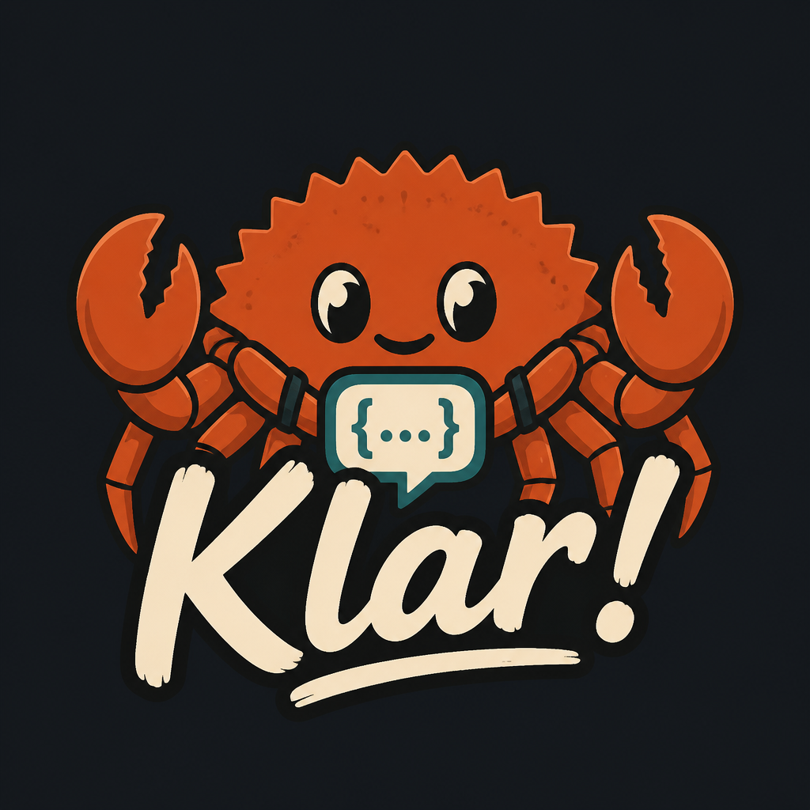

# Klar NLU

<p align="center">
  
</p>

[English](README.md) · [Deutsch](README.de.md)

[](https://github.com/FABBricate-IT-Solutions/klar-ha-nlu/actions/workflows/ci.yml)
[](https://github.com/FABBricate-IT-Solutions/klar-ha-nlu/actions/workflows/security.yml)
[](https://github.com/FABBricate-IT-Solutions/klar-ha-nlu/actions/workflows/build.yml)
[](LICENSE)

Deterministische Sprachsteuerung für Home Assistant. Klar zerlegt gesprochene Sätze in HA-Intents — ohne Cloud, ohne Modellgewichte.

Deutsch und Englisch sind eingebaut und laufen parallel. Weitere Sprachen kommen als Paket dazu, nicht als Sonderfälle in der Engine.

```
„Licht im Wohnzimmer an“     →  HassTurnOn   area=wohnzimmer  domain=light
„Set the garage door to 40%“ →  HassSetPosition  cover.garage_door
```

## Was Klar macht

- Hausbefehle: Licht, Klima, Cover, Schloss, Lüfter, Medien, Timer, Listen, Szenen
- Mehrere Klauseln (`Wohnzimmer und Küche`, `mach das Licht aus und die Heizung auf 21`)
- Rückfragen, wenn ein Gerät nicht eindeutig ist
- Sitzung: „mach sie aus“ bezieht sich auf das letzte Ziel
- Optionaler LLM-Fallback in Home Assistant für Smalltalk, sobald Klar keinen Hausbefehl sieht

Klar steuert Geräte selbst. Ein LLM kommt nur zum Zug, wenn nichts zugeordnet wurde.

## Schnellstart

Rust 1.85+, dann:

```bash
cargo run --release -- --config-dir /pfad/zur/ha-config --http 0.0.0.0:10520 --wyoming 0.0.0.0:10500
```

Ohne HA-Config nutzt Klar eine eingebaute Musterwohnung.

| Port  | Dienst              |
|-------|---------------------|
| 10520 | Web-UI und Parse-API |
| 10500 | Wyoming Intent      |

UI: <http://127.0.0.1:10520>

## Home Assistant

1. `custom_components/klar_nlu` nach `config/custom_components/klar_nlu` kopieren
2. Klar-Binary oder Add-on starten
3. Integration **Klar NLU** hinzufügen (URL, Standard `http://127.0.0.1:10520`)
4. Assist-Pipeline: Conversation-Engine = **Klar NLU**
5. Optional in den Optionen einen Conversation-Agent für Smalltalk wählen

Ausführlich: [docs/home-assistant.md](docs/home-assistant.md) · [English](docs/en/home-assistant.md)

## Dokumentation

| Thema | English | Deutsch |
|-------|---------|---------|
| Architektur | [docs/en/architecture.md](docs/en/architecture.md) | [docs/architecture.md](docs/architecture.md) |
| HTTP- und Wyoming-API | [docs/en/api.md](docs/en/api.md) | [docs/api.md](docs/api.md) |
| Home Assistant | [docs/en/home-assistant.md](docs/en/home-assistant.md) | [docs/home-assistant.md](docs/home-assistant.md) |
| Sprachen erweitern | [docs/en/languages.md](docs/en/languages.md) | [docs/languages.md](docs/languages.md) |
| Tests | [docs/en/testing.md](docs/en/testing.md) | [docs/testing.md](docs/testing.md) |

## Tests

```bash
cargo test -- --test-threads=1
```

Wohnung DE/EN und beide Familiensuiten müssen 100 % halten. Details in [docs/testing.md](docs/testing.md).

## Lizenz

[MIT](LICENSE) — Copyright 2026 FABBricate IT Solutions
