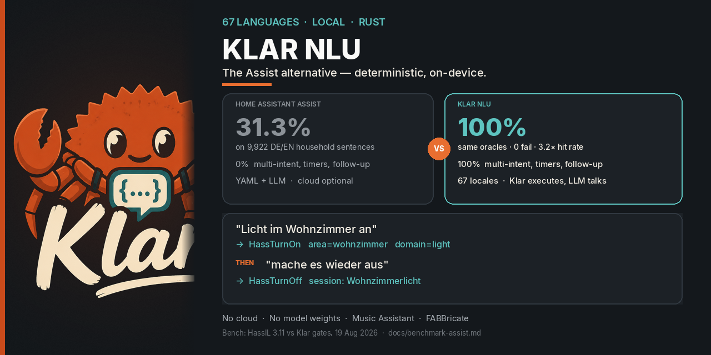

# Klar NLU

<div align="center">



</div>

[English](README.md) · [Deutsch](README.de.md)

[](https://github.com/FABBricate-IT-Solutions/klar-ha-nlu/actions/workflows/ci.yml)
[](https://github.com/FABBricate-IT-Solutions/klar-ha-nlu/actions/workflows/security.yml)
[](https://github.com/FABBricate-IT-Solutions/klar-ha-nlu/actions/workflows/build.yml)
[](https://github.com/FABBricate-IT-Solutions/klar-ha-nlu/actions/workflows/validate.yml)
[](https://github.com/hacs/integration)
[](LICENSE)

Deterministische Sprachsteuerung für Home Assistant — **67 Sprachen**, lokal, ohne Cloud. Assist-Alternative: **100 % vs 31,3 %** auf 9.922 DE/EN-Haussätzen ([Benchmark](docs/benchmark-assist.md)). Klar steuert das Haus; ein LLM redet nur.

**Haushaltsweg:** [Einstieg](docs/getting-started.md) — Teile unten installieren → Entitäten freigeben → Assist-Pipeline → fünf Sätze → Zuordnung. Wenn etwas fehlt: [Fehlerbehebung](docs/troubleshooting.md).

**Breaking V2:** HTTP-Parse läuft nur noch über `POST /api/v2/parse` (`schema_version: "2.0"`). Rust-Engine und Home-Assistant-Integration zusammen aktualisieren. `POST /api/parse` entfällt. Vorhandene `klar_nlu.json`-Overlays laden weiter; `klar migrate import --from` prüft Konflikte, Waisen und unsichere Settings, bevor V2 geschrieben wird.

Jede kompilierte Assist-Locale ist erstklassig. Deutsch und Englisch sind handgeschriebene Referenzpacks und nützliche Beispiele; generierte Packs nutzen denselben Weg. Siehe [Sprachen](docs/languages.md).

```
„Licht im Wohnzimmer an“     →  HassTurnOn   area=wohnzimmer  domain=light
„Set the garage door to 40%“ →  HassSetPosition  cover.garage_door
„Spiel Queen“ / „Play Queen“ →  Music-Assistant-Suche
```

## Was Klar NLU macht

- Hausbefehle: Licht, Klima, Cover, Schloss, Lüfter, Medien (inkl. Music Assistant), Timer, Listen, Szenen
- Mehrere Klauseln (`Wohnzimmer und Küche`, `mach das Licht aus und die Heizung auf 21`)
- Rückfragen, wenn ein Gerät nicht eindeutig ist
- Sitzung: „mach sie aus“ bezieht sich auf das letzte Ziel
- Persönlichkeiten in Home Assistant (Butler, Grantig, Pirat, …) — Assist, Sprechformel und optionale LLM-Umformulierung folgen derselben Auswahl
- Optionaler LLM-Fallback in Home Assistant für Smalltalk, sobald Klar keinen Hausbefehl sieht
- Optionale LLM-Verfeinerung fertiger NLU-Antworten (standardmäßig aus; Gerätesteuerung bleibt bei Klar)

Klar NLU steuert Geräte selbst. Ein LLM redet oder formuliert um — Haus-Intents führt es nicht aus.

## Home Assistant

Klar besteht aus zwei Teilen. Sie machen unterschiedliche Jobs. Beides zu installieren macht das Parsen **nicht** genauer.

| Teil | Rolle | Installieren, wenn… |
|------|-------|---------------------|
| **HACS-Integration** | Conversation-Agent für Assist: Räume/Geräte synchronisieren, Intents ausführen | Assist Klar nutzen soll (immer) |
| **App (Add-on)** | NLU-Engine im eigenen Container, Zuordnung / Labor in der Seitenleiste | Home Assistant OS und diese UI gewünscht |
| **Mitgelieferte Engine** | Dieselbe Integration lädt das GitHub-Release und startet die Engine in Core | Keine App (Container / Core, oder HAOS ohne App) |

Nur **einen** Engine-Host. App und mitgelieferte Engine nicht gleichzeitig.

- **Home Assistant OS:** **beide** — HACS für Assist, die App für Engine und Zuordnung/Labor. Seitenleiste **Klar NLU** ist die App; Lovelace **Klar** ist nur der letzte Assist-Zug.
- **Ohne Supervisor:** nur HACS, beim Setup **Mitgelieferte Engine starten (nur HACS)** behalten.
- **App ohne HACS:** Zuordnung/Labor können öffnen, Assist nutzt Klar aber nicht.

[](https://my.home-assistant.io/redirect/hacs_repository/?owner=FABBricate-IT-Solutions&repository=klar-ha-nlu&category=integration)

1. Badge klicken, oder in HACS → Integrationen → ⋮ → Benutzerdefinierte Repositories `https://github.com/FABBricate-IT-Solutions/klar-ha-nlu` als **Integration** hinzufügen
2. **Klar NLU** herunterladen und Home Assistant neu starten
3. Unter Home Assistant OS zusätzlich das [App-Repository](https://my.home-assistant.io/redirect/supervisor_add_addon_repository/?repository_url=https%3A%2F%2Fgithub.com%2FFABBricate-IT-Solutions%2Fklar-ha-nlu) hinzufügen, **Klar NLU** installieren und starten
4. [](https://my.home-assistant.io/redirect/config_flow_start/?domain=klar_nlu) — mit laufender App **Klar-NLU-App oder Docker verwenden**; ohne App **Mitgelieferte Engine starten (nur HACS)**
5. Geräte freigeben, mit denen ihr sprechen wollt (Einstellungen → Sprachassistenten → Freigeben)
6. Assist-Pipeline: Conversation-Engine = **Klar NLU**
7. Optional in den Optionen einen Conversation-Agent für Smalltalk wählen. Dort auch: Persönlichkeit, und **NLU-Antworten vom LLM verfeinern**, wenn der Agent Bestätigungen umformulieren soll

Schritt für Schritt mit Beispielsätzen: [docs/getting-started.md](docs/getting-started.md). Ausführlich: [docs/home-assistant.md](docs/home-assistant.md).

Release Candidates: Konfigurieren → **Release-Kanal** → Staging. Das zeigt auf `http://klar-nlu-staging:10520` oder das neueste GitHub-Prerelease. Stable geht zurück auf `http://klar-nlu:10520`. Siehe [Releases](docs/releases.md).

### Docker

Image-Tag auf die Engine-CalVer pinnen (wie `Cargo.toml` / das GitHub-Release). Aktueller Stand: **2026.8.30**.

```bash
docker run --rm --network host \
  -v /pfad/zur/homeassistant/config:/config:ro \
  ghcr.io/fabbricate-it-solutions/klar-nlu:2026.8.30
```

Integrations-URL: `http://127.0.0.1:10520`. Es gibt auch Images pro Arch (`klar-nlu-amd64`, `klar-nlu-aarch64`). RC-Images: Tag `staging`.

Manuell: `custom_components/klar_nlu` nach `config/custom_components/klar_nlu` kopieren, dann neu starten.

Ausführlich: [docs/home-assistant.md](docs/home-assistant.md) · [English](docs/en/home-assistant.md)

## Dokumentation

| Thema | English | Deutsch |
|-------|---------|---------|
| Einstieg | [docs/en/getting-started.md](docs/en/getting-started.md) | [docs/getting-started.md](docs/getting-started.md) |
| Fehlerbehebung und Datenschutz | [docs/en/troubleshooting.md](docs/en/troubleshooting.md) | [docs/troubleshooting.md](docs/troubleshooting.md) |
| Home Assistant | [docs/en/home-assistant.md](docs/en/home-assistant.md) | [docs/home-assistant.md](docs/home-assistant.md) |
| HTTP- und Wyoming-API | [docs/en/api.md](docs/en/api.md) | [docs/api.md](docs/api.md) |
| Sprachen | [docs/en/languages.md](docs/en/languages.md) | [docs/languages.md](docs/languages.md) |
| Architektur | [docs/en/architecture.md](docs/en/architecture.md) | [docs/architecture.md](docs/architecture.md) |
| Tests | [docs/en/testing.md](docs/en/testing.md) | [docs/testing.md](docs/testing.md) |
| Releases | [docs/en/releases.md](docs/en/releases.md) | [docs/releases.md](docs/releases.md) |
| Mitwirken | [CONTRIBUTING.md](CONTRIBUTING.md) | |

## Aufbau

Die Rust-Engine ist in klare Schichten geteilt:

- `src/types/` definiert Intents, `ParseOutcome`, Settings und den Home-Graph.
- `src/nlu/` rankt Kandidaten und wendet Confidence-, OOD-, Confirm- und Multi-Intent-Policy an.
- `src/parse/` tokenisiert, erkennt Aktionen, löst Ziele auf und füllt Slots.
- `src/home/` lädt Home-Assistant-Registries, Overlays, Expose-Daten, Rollen und die eingebaute Musterwohnung.
- `src/eval/` und `src/migrate.rs` liefern Held-out-Scorecards und den einmaligen V1-Overlay-Import.
- `src/io/` enthält HTTP, Wyoming, gemeinsamen Runtime-State, Token-Handling und Reloads.

Zur Laufzeit baut Klar NLU einen effektiven Home-Graph aus HA-Config und beschreibbarem Datenverzeichnis. Parse-API und Wyoming-Server teilen diesen Graphen und denselben Session-Store, deshalb verhalten sich Follow-ups auf beiden Schnittstellen gleich.

## Schnellstart (aus dem Quellcode)

Rust 1.85+, dann:

```bash
cargo run --release -- --config-dir /pfad/zur/ha-config --http 0.0.0.0:10520 --wyoming 0.0.0.0:10500
```

Ohne HA-Config nutzt Klar NLU eine eingebaute Musterwohnung.

| Port  | Dienst              |
|-------|---------------------|
| 10520 | Web-UI und Parse-API |
| 10500 | Wyoming Intent      |

UI: <http://127.0.0.1:10520> — React-Operator-UI (Home, Gespräche, Regeln, Haus / Zuordnung, Labor, Einstellungen).

Nützliche Checks bei der Entwicklung:

```bash
cargo fmt --check
cargo check
cargo nextest run
cargo run --quiet -- lang validate packs
cargo run --quiet -- eval bench --repeat 8
cargo build --release
```

`scripts/lang_packs/generate.py` nicht im Pre-Commit ausführen. Siehe [CONTRIBUTING.md](CONTRIBUTING.md).

## Releases

Changelogs kommen von [git-cliff](https://git-cliff.org/) und [Conventional Commits](https://www.conventionalcommits.org/) (`feat:`, `fix:`, `docs:`, …). Siehe [CHANGELOG.md](CHANGELOG.md).

Jeder Merge auf `main` erhöht die [Home-Assistant-CalVer](https://developers.home-assistant.io/docs/versioning/) (`YYYY.M.PATCH`), schreibt das Changelog und taggt. Der Build-Workflow hängt danach linux-x86_64- und linux-aarch64-Tarballs an das GitHub Release. **Actions → Release → Run workflow** bleibt für einen manuellen Override. Ein manuelles `git tag 2026.8.0 && git push origin 2026.8.0` geht weiter.

Dependabot öffnet wöchentlich PRs für Crates und Actions; `cargo-audit` und `cargo-deny` laufen bei jeder Änderung.

## Tests

```bash
cargo nextest run
```

Die verbindlichen Voice-Suite-Schwellen stehen in
[docs/testing.md](docs/testing.md). 100 % bleibt das Ziel, die aktuell
blockierenden Schwellen der generierten Vergleichssuiten liegen jedoch
darunter.

## Lizenz

[MIT](LICENSE) — Copyright 2026 FABBricate IT Solutions
