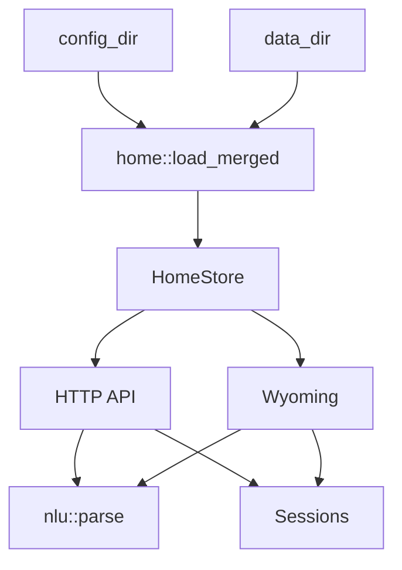

# Architektur

[Deutsch](architecture.md) · [English](en/architecture.md)

Klar ist eine regelbasierte NLU. Ein Satz wird tokenisiert, gegen Wortlisten geprüft und in Home-Assistant-Intents übersetzt. `nlu::parse` enthält kein Modell und kein Netz.

Optional spricht die Engine eine **OpenAI-kompatible** Chat-API (`src/llm/`, SSE-Streaming) für Trainer und Sprach-Fallback. Python in der Integration ist nur Kleber: Endpoint aus dem HA-Agenten kopieren, Tokens ins Assist-Chat-Log schieben. Siehe [adr-0002-openai-llm-client.md](architecture/adr-0002-openai-llm-client.md).

## Laufzeitkarte

Interaktiver Weg Assist → `POST /api/v2/parse` → `nlu::parse` → Intent, mit git-geprüften Quellstellen. [runtime.html](architecture/runtime.html) lokal öffnen; typisierte Quelle: [runtime.architecture.json](architecture/runtime.architecture.json).

[](architecture/runtime.html)

## Ablauf

```
Text
  → fold_latin / tokenize
  → Füllwörter streichen (bitte, please, the, …)
  → detect_actions / resolve / Slots
  → vollständige IntentPlans ranken
  → Safety-Policy           execute / confirm / clarify / reject / chat
  → ParseOutcome            Plan nur bei execute
```

In Home Assistant kann der gesprochene Satz eine Persönlichkeitsformel bekommen und, wenn eingeschaltet, vom LLM umformuliert werden. Die Umformulierung läuft über Klar (`POST /api/v2/llm/chat`); die Integration streamt nur nach Assist. Optionale lokale Semantik-Adapter dürfen nach einem Ranking-Reject einen typisierten Plan vorschlagen; Geräte führen sie nicht aus.

`nlu::parse` in `src/nlu/` ist der Einstieg und liefert `ParseOutcome` (`schema_version: "2.0"`). Vor dem Parse bindet Klar die in `Settings.languages` gewählten Pakete (`de`, `en`, …). Confirm, Clarify und Reject serialisieren weder `plan` noch `candidates`.

## Schichten

| Modul | Aufgabe |
|-------|---------|
| `src/types/` | Intent, `ParseOutcome`, Settings und Home-Graph |
| `src/nlu/` | Ranking, Confidence/OOD/Confirm-Policy, Semantik-Adapter |
| `src/lang/` | Wortlisten, externe Pakete, Benutzer-Overlays |
| `src/home/` | Home-Graph laden, Overlay, Expose-Filter, Rollen und Policy |
| `src/parse/` | Token, Actions, Resolve, Slots, gesprochene Antworten |
| `src/eval/` | Held-out-Metriken, Assist-Vergleich, Scorecard, Benches |
| `src/migrate.rs` | Einmaliger V1-Overlay-Dry-Run / V2-Save |
| `src/session.rs` | letztes Ziel, offenes Clarify/Confirm |
| `src/llm/` | OpenAI-kompatibler Chat-Client, SSE, Trainer-Prompt |
| `src/io/` | HTTP (`/api/v2/parse`, `/api/v2/llm/chat`), Wyoming, redigierte Bundles, Bootstrap |

## Modulbaum

```text
src/
  types/             Intent, ParseOutcome, Settings, HomeGraph
  nlu/               Ranking, Policy, Semantik-Adapter
  home/              Registry/YAML-Lader, Overlay, Policy, Rollen
  lang/              Pakete, Catalog, Benutzer-Overlays
  parse/             Token, Actions, Resolve, Slots, Antworten
  eval/              Held-out-Scorecard und Benches
  migrate.rs         V1-Overlay-Importbericht
  session.rs         Conversation Memory
  llm/               OpenAI-kompatibler Client, SSE
  io/                HTTP, Wyoming, Runtime-State, redigierte Bundles
  main.rs            CLI (lang / eval / migrate), dann io::run
```

`lib.rs` exportiert diese Schichten. Interne Parse-Helfer bleiben unter `src/parse/`; Home-Assistant-Laden und Overlay bleiben unter `src/home/`.

## Home-Graph

Beim Start liest Klar `core.entity_registry`, `core.device_registry` und `core.area_registry` aus `--config-dir` (meist `/config`). Anzeigenamen kommen vom Gerät, wenn die Entity keinen eigenen Namen hat (`has_entity_name`). Fehlt die Registry, gilt `default_home()`.

Geräte werden über Namen, Aliase, Tags und Area getroffen. Generische Wörter (`Licht`, `light`) bleiben auf Area-Ebene, wenn mehrere Leuchten im Raum sind — dann fragt Klar nach.

`home::load_merged(config_dir, data_dir)` baut daraus den effektiven Graph:

1. HA-Registry oder Musterwohnung laden.
2. Overlay aus `config_dir` anwenden.
3. Falls `data_dir != config_dir`, Overlay aus `data_dir` darüber anwenden.
4. `Settings` und Custom Sentences aus dem letzten passenden Overlay übernehmen.

`HomeStore` hält den aktuellen `Arc<HomeGraph>` und liefert Snapshots an HTTP und Wyoming. Reloads beobachten die HA-Registry-Dateien; bei Änderung wird der Graph neu geladen und atomar ersetzt.



## Sitzung

Dieselbe `conversation_id` teilt sich eine `Session`:

- letztes Gerät / letzter Raum / letzte Domain
- offene Clarify-Liste (`Meinst du Decke oder Lampe?`)
- offenes Confirm für riskante Schloss-/Cover-Aktionen (Plan bleibt in der Session bis `ja`)
- `ja` / `yes` prüft den gespeicherten Plan gegen den aktuellen Graph neu

## Intents

Klar erzeugt die üblichen Assist-Intents, unter anderem:

`HassTurnOn`, `HassTurnOff`, `HassToggle`, `HassLightSet`, `HassClimateSetTemperature`, `HassGetState`, `HassSetPosition`, `HassFanSetSpeed`, `HassStartTimer`, `HassIncreaseTimer`, `HassShoppingListAddItem`, `HassMediaPause`, `HassMediaNext`, `HassVacuumStart`

Slots: `entity_id`, `area`, `floor`, `domain`, plus je nach Aktion `brightness`, `temperature`, `position`, `percentage`, `color`, `duration`.

## Grenzen

- Kein freies Weltwissen. „Erzähl einen Witz“ bleibt leer — in HA übernimmt dann der Fallback-Agent.
- Keine Assist-Werkzeuge im Motor. Geräte laufen nur über die erkannten Intents. Klar darf die fertige Bestätigung über den OpenAI-kompatiblen Client umformulieren; HA schiebt nur Tokens ins Chat-Log und vergibt dafür keine Assist-Werkzeuge.
- Dateien unter 500 Zeilen halten; neue Sprache = neues Paket, nicht eine längere `match`-Liste.
