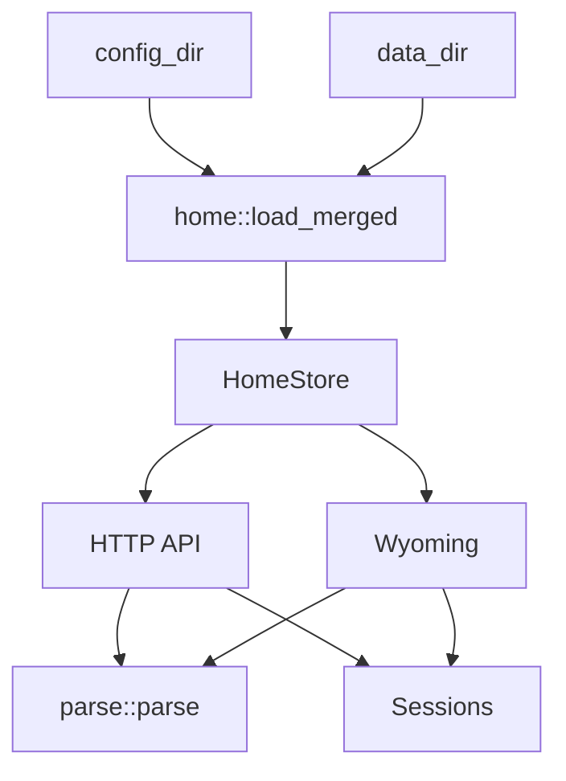

# Architektur

[Deutsch](architecture.md) · [English](en/architecture.md)

Klar ist eine regelbasierte NLU. Ein Satz wird tokenisiert, gegen Wortlisten geprüft und in Home-Assistant-Intents übersetzt. Es gibt kein neuronales Netz in der Engine.

## Ablauf

```
Text
  → fold_latin / tokenize
  → Füllwörter streichen (bitte, please, the, …)
  → detect_actions          Verbklassen aus den Sprachpaketen
  → split_clauses           und / and / dann, wenn ein neues Verb kommt
  → resolve                 Räume und Geräte aus dem Home-Graph
  → fill_intent             HassTurnOn, HassLightSet, …
  → speak                   kurze Bestätigung
```

In Home Assistant kann der gesprochene Satz eine Persönlichkeitsformel bekommen und, wenn eingeschaltet, vom LLM umformuliert werden (`custom_components/klar_nlu/refine.py`). Die Engine selbst bleibt regelbasiert.

`parse()` in `src/parse/mod.rs` ist der Einstieg. Vor dem Parse bindet Klar die in `Settings.languages` gewählten Pakete (`de`, `en`, …).

Der Einstieg ist absichtlich schmal:

1. `preprocess` tokenisiert und erweitert zusammengesetzte Raum-/Gerätewörter.
2. `route_non_home` erkennt News, Smalltalk, Korrektur und LLM-Fallback.
3. `session_followups` behandelt Ja/Nein, offene Rückfragen und Custom Sentences.
4. `parse_clauses` zerlegt Mehrfachbefehle und ruft die Clause-Policies auf.
5. `fill_replay_or_need_target` ergänzt Follow-up-Ziele oder fragt nach einem Ziel.

## Schichten

| Modul | Aufgabe |
|-------|---------|
| `src/types/` | Intent-, Settings- und Home-Graph-Datenformen |
| `src/lang/` | Wortlisten pro Sprache, zusammengeführt im Catalog |
| `src/home/` | Home-Graph laden, Overlay, Expose-Filter, Rollen und Policy |
| `src/parse/action.rs` | Verbklasse → `Action` (On, CoverOpen, SetTemp, …) |
| `src/parse/normalize.rs` | Token, Akzente, Füller |
| `src/parse/numbers.rs` | Zahlwörter und Ziffern |
| `src/parse/split.rs` | Klauseln, Follow-up-Leuchten |
| `src/parse/resolve/` | Entity- und Area-Treffer, Scoring |
| `src/parse/mod.rs` / `src/parse/infer.rs` / `src/parse/slots.rs` | Orchestrierung, Clarify, Intents |
| `src/parse/respond.rs` | gesprochene Bestätigung |
| `src/session.rs` | letztes Ziel, offene Rückfrage |
| `src/io/web.rs` | HTTP |
| `src/io/wyoming.rs` | Wyoming Intent |
| `src/io/bootstrap.rs` | Server-Start, Token, Reload-Loop |

## Modulbaum

```text
src/
  types/             Intent-, Settings- und HomeGraph-Typen
  home/              Registry/YAML-Lader, Overlay, Policy, Rollen, Sample Home
  lang/              Sprachpakete, Catalog, Speech-Templates
  parse/             NLU-Pipeline, Actions, Resolve, Slots, Antworten
    resolve/         Resolve-Fassade plus Scoring
  session.rs         Conversation Memory und Clarify-State
  io/                HTTP, Wyoming, Runtime-State, Bootstrap
  main.rs            CLI-Argumente und Logging, dann io::run
```

`lib.rs` exportiert nur diese Schichten. Interne Parse-Helfer bleiben unter `src/parse/`; Home-Assistant-spezifisches Laden und Overlay-Handling bleibt unter `src/home/`.

## Home-Graph

Beim Start liest Klar `core.entity_registry`, `core.device_registry` und `core.area_registry` aus `--config-dir` (meist `/config`). Anzeigenamen kommen vom Gerät, wenn die Entity keinen eigenen Namen hat (`has_entity_name`). Fehlt die Registry, gilt `default_home()`.

Geräte werden über Namen, Aliase, Tags und Area getroffen. Generische Wörter (`Licht`, `light`) bleiben auf Area-Ebene, wenn mehrere Leuchten im Raum sind — dann fragt Klar nach.

`home::load_merged(config_dir, data_dir)` baut daraus den effektiven Graph:

1. HA-Registry oder Musterwohnung laden.
2. Overlay aus `config_dir` anwenden.
3. Falls `data_dir != config_dir`, Overlay aus `data_dir` darüber anwenden.
4. `Settings` und Custom Sentences aus dem letzten passenden Overlay übernehmen.

`HomeStore` hält den aktuellen `Arc<HomeGraph>` und liefert Snapshots an HTTP und Wyoming. Reloads beobachten die HA-Registry-Dateien; bei Änderung wird der Graph neu geladen und atomar ersetzt.



## Sitzung

Dieselbe `conversation_id` teilt sich eine `Session`:

- letztes Gerät / letzter Raum / letzte Domain
- offene Clarify-Liste (`Meinst du Decke oder Lampe?`)
- `ja` / `yes` wiederholt den letzten Schalt-Intent

## Intents

Klar erzeugt die üblichen Assist-Intents, unter anderem:

`HassTurnOn`, `HassTurnOff`, `HassToggle`, `HassLightSet`, `HassClimateSetTemperature`, `HassGetState`, `HassSetPosition`, `HassFanSetSpeed`, `HassStartTimer`, `HassIncreaseTimer`, `HassShoppingListAddItem`, `HassMediaPause`, `HassMediaNext`, `HassVacuumStart`

Slots: `entity_id`, `area`, `domain`, plus je nach Aktion `brightness`, `temperature`, `position`, `percentage`, `color`, `duration`.

## Grenzen

- Kein freies Weltwissen. „Erzähl einen Witz“ bleibt leer — in HA übernimmt dann der Fallback-Agent.
- Keine Werkzeuge im Motor. Geräte laufen nur über die erkannten Intents. Ein optionales LLM in HA darf die fertige Bestätigung umformulieren; Assist-Werkzeuge bekommt es dafür nicht.
- Dateien unter 500 Zeilen halten; neue Sprache = neues Paket, nicht eine längere `match`-Liste.
