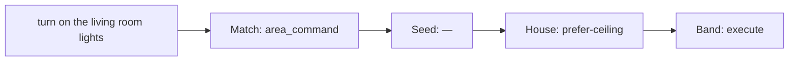

# ADR 0001 — Visible rules, language seeds, and an LLM trainer

[Deutsch](adr-0001-rules-and-trainer.md) · [English](adr-0001-rules-and-trainer.en.md)

Status: **proposed** — direction accepted. Implementation on **`staging`**, not a main release: [plan](adr-0001-plan.en.md).

Klar stays a deterministic, local NLU. An LLM may **set up** the house; it must not **drive** the parse path. All three layers are **visible, controllable, and trainable** in the operator UI. Every parse draws the same path.

## The idea, as we understand it

Behavior lives on **three layers** that the same utterance walks in order:

1. **Match** — *how* tokens become an intent candidate (`PolicyId`: `area_command`, `grounded_entities`, `media`, …).
2. **Language** — two seeds of the same locale: **lexicon** (verbs/nouns, plus overlay for slang) and **govern seed** (confirm locks). Shipped with the pack.
3. **House** — overlay for this graph: operator and trainer rules that replace or extend the seed.

Today Match and safety are invisible in code, the Rules tab only knows an empty house list, and Lab shows a coarse process chip (`conversation.process`) rather than *which layer decided why*.

Desired:

- **Manage** all three layers in the operator UI: on/off, order, content — plus **LLM proposals** per layer.
- **Visualize** those three layers sharply: static (how they stack) and live (which path *this* sentence took). A click on a node opens the rule.

Match stays compiled (no freely invented matching DSL). Controllable means an overlay on the catalog (enable, precedence), not new `PolicyId` functions from the model. Every compiled Assist locale (`GET /api/v2/languages`) is first-class — de/en are oracles, not a support caste.

## Current state (short)

```
Text → tokenize → PolicyId match (fixed) → ranking
    → overlay PolicyRule (often empty) + compiled_risky
    → band: execute / confirm / clarify / reject / chat
```

| Piece | Gap |
|-------|-----|
| Overlay `PolicyRule` | house only, empty, no origin, max 64 |
| Evaluate / Lab `.flow` | overlay hit + `compiled_risky`; no layer path |
| `IntentCandidate.policy` | match name in JSON, not in the Rules UI |
| Language packs | compiled lexicon; overlay `SetDelta` exists but barely in the Rules UI |
| Govern seeds | missing |
| `risky_intent` / infra | invisible |
| Trainer | missing |

## Strategy: three control surfaces, one interpreter

Not strategy B (Match as a freely writable DSL). Not trace-only with no knobs.

```
Match catalog (compiled functions)
  + match overlay: enabled, precedence     ← UI + trainer
       ↓ candidates
Language: lexicon pack + lexicon overlay         ← UI + trainer (add/remove tokens)
       + govern seed                             ← UI + trainer (on/off, reset)
       ↓ first matching seed rule
House overlay                              ← UI + trainer (full PolicyRule)
       ↓ first matching house rule wins over seed
Invariants: validate_plan, expose, schema (always in the trace, no trainer)
```

Pre-seeded per language are **two** seeds, plus an overlay:

1. **Lexicon pack** (already compiled): verbs, nouns, fillers. That *is* the pre-seeded database.
2. **Lexicon overlay** (already `LanguageOverlay` / `SetDelta`): slang, dialect, house words. Preview and rollback exist.
3. **Govern seed** (new): one language-free safety bundle bound with **every** pack.

## Layer contract

### 1. Match — catalog plus overlay

Each `PolicyId` is a catalog row. The operator sees the **full list** (about 24 ids, precedence 0–21 today), not only the one that fired.

Control lives in the overlay, not in Rust:

```json
{ "id": "media", "enabled": false, "precedence": 3 }
```

| May | Must not |
|-----|----------|
| on/off, drag precedence, reset to engine default | invent a PolicyId, rewrite matcher source, change tokenizer/fuzzy |

Example: house with no `media_player` → turn `media` off. Many lamps with the same name → put `grounded_ambiguous` ahead of `follow_named`. The trainer proposes exactly those overlays, with a reason from the graph.

Disabled ids are skipped in `parse_clause_candidates_for_action`. Unknown ids → 400. Reset deletes the overlay row.

### 2. Language — lexicon database plus govern seed

A pack that “does not fit” (slang, dialect, exotic forms) is **not** fixed with a `PolicyRule`. Match only sees tokens that are in the catalog. `when.phrase = “turn on the funzel”` does not scale and bypasses the lexicon.

Right path: the pack **is** the pre-seeded database. Visible in the Language lane, overridable through the same overlay `POST /api/lang/overlay` already writes (`sets.nouns.light_nouns.add = ["funzel"]`). The trainer may **add/remove on known set paths**, after preview and locale smokes.

| May (lexicon) | Must not |
|---------------|----------|
| Add a token on an existing path (`nouns.light_nouns`, `cues.on_words`, …) | Replace the pack file, change morphology / `NumberStyle` / tokenizer |
| Remove an overlay token, reset the pack | Flip `VerbKind` of a builtin token (same conflict as external packs) |
| Dialect as an overlay on `de` (not every slang pack is a locale) | Merge every locale into one catalog; fillers that eat particles (`an` / `aus`) |

`set_field` today allows only a subset of sets. Extend paths for slang if needed (more nouns, cues). New verbs only as a **new** token plus an explicit `VerbKind`; collision with builtin → reject.

Govern seed sits beside that, e.g. `src/lang/packs/de/govern.json`. Ordinary `PolicyRule`s, stable ids:

| Id | when | effect |
|----|------|--------|
| `seed:confirm-lock` | domain `lock` | `confirm` |
| `seed:confirm-cover-close` | cover + `HassTurnOff` | `confirm` |
| `seed:block-area-lock` | lock + area | `block` |

UI: the Language lane has two lists — **lexicon** (pack read-only + overlay deltas) and **govern**. Toggle/reset on govern as planned. Lexicon deltas are `add`/`remove`, not drag order. A house rule with the same govern id **replaces** the seed. Extra house rules sit **in front**. Seeds do not count against the 64.

Trainer: (a) lexicon — tokens from journal/gaps (`funzel` → `nouns.light_nouns`); (b) govern — which seeds fit this graph.

### 3. House — overlay

Today’s bundle in `klar_nlu.json`, plus `origin` (`operator` \| `trainer`) and `replaces`. Full `PolicyRule` editing as today. The trainer writes house-precise rules (block the kids’ AC, “good night” → script, prefer the ceiling light).

### Invariants

`validate_plan`, Assist expose, and schema stay. `compiled_risky` as a floor: on at first; the trace distinguishes rule `confirm` vs the floor.

## Operator UI: three lanes, one path

The Rules tab becomes the control surface. Lab and conversations **read the same path**; they do not edit it.

### Static — the stack

Three columns, one order, matching runtime:

```
Match (engine)          Language                 House
──────────────          ──────────────           ────
[on] laundry_switch 0   lexicon overlay +2       1  kids AC    block
[on] timer          1     funzel → light_nouns   2  good night script
[off] media         3   govern seed
[on] area_command   8     [on] seed:confirm-lock
…                       [off] seed:prefer-climate
…
Trainer for this lane →  evaluate utterance  →  path below
```

- The active lane decides what Save / Trainer / Reset do.
- Drag only inside a lane (match precedence, house order). Seed order comes from the pack.
- Origin chip: `engine` / `seed` / `operator` / `trainer`.

### Live — path of this sentence

Evaluate and Lab replace the five cards (`compiled_risky`, `matched_rule`, …) with **one track of three required nodes**. Skipped layers still render as nodes (`—`), otherwise you cannot see that they were checked.



Each node:

- **layer** + **id** or `—`
- short why: score/margin on Match, `when` hit on govern, `compiled_risky` only if neither seed nor house fired
- click jumps to the lane and selects the row
- underneath: match losers (`discarded`, already on `ParseTrace`)

The same `PolicyPath` in Rules evaluate, Lab (today `.flow` / `processPath`), and optionally a conversation row. One source, three surfaces.

Explain speech and `POST /api/lang/explain` speak the same ids: “Match `area_command`, house `prefer-ceiling`, executed.”

## LLM trainer, per layer

Still not on the parse hot path, no device tools. The operator triggers **per lane** or “set up the house (all lanes).”

```
Graph + gaps + current overlays + language seed + match catalog
  → proposal with a layer field
  → sanitize + grounding
  → dry-run on house and locale smokes
  → diff on the lane: accept / reject / edit
```

| Layer | Schema | Example |
|-------|--------|---------|
| Match | `{ id, enabled, precedence? }[]` | turn `media` off because the graph has no player |
| Lexicon | `{ path, add?, remove? }[]` | `nouns.light_nouns` += `funzel` |
| Seed | `{ id, enabled, prefer? }[]` | point `seed:prefer-climate` at `climate.living_room` |
| House | `PolicyRule[]` | phrase “good night” → `script.good_night` |

The model must not invent match ids, new effects, or entity ids off the graph. Prompt versioned, HA fallback LLM, engine without a net.

## Phases

1. **Path + catalog, still rigid**  
   `PolicyTrace` with `match`, `seed`, `house`, `band`, `discarded`. Shared path component in Rules and Lab. Three lanes visible; Match/Seed still toggle-less (read-only); house as today. Gate: contract tests; scorecard unchanged.

2. **Match and language controls**  
   Overlay `match_controls`; seed toggles; lexicon deltas visible in the same lane (API already exists). Evaluate honors all of them. Reset-to-default. Parity: defaults = today’s behavior.

3. **Safety as seed for every locale**  
   One language-free govern bundle on every pack. `compiled_risky` stays the floor until `assist_langs` + `parity_langs` hold.

4. **Trainer**  
   Context + validate with `language`. Tests on a reference locale **and** a generated one.

5. **Optional: household phrases**  
   Only via a generator for `LangId::all()`.

Each stage is its own PR against **`staging`**; the [implementation plan](adr-0001-plan.en.md) is the order with files, gates, stop rules, and delivery channel. Promoting to `main` is a later, deliberate step — not the default. This ADR stays the frame.

## Open questions

1. Keep the `compiled_risky` floor if the operator turns off `seed:confirm-lock`? (at first: floor on)
2. Trainer UI-only or also an Assist conversation? (v1: UI only; proposals land on the lane)
3. Household phrases in phase 6? (later)
4. Keep `origin: trainer` visible? (yes)
5. Infra: tags on the graph, needles as match/seed hints, no free text from the model

New because of the three lanes:

6. May dragging precedence twist Match enough to fail locale smokes? (evaluate warns; save allowed; reset is one click)
7. One trainer run across all lanes, or always one lane? (UI can offer both; apply stays confirmed per lane)
8. May the trainer propose lexicon tokens that flip locale smokes? (preview required; apply only after a green dry-run or an explicit override)
9. Extend overlay paths to all nouns/cues, or keep verbs on ExternalPack only? (recommendation: extend nouns/cues; verbs only as new tokens)

## Consequences

- The Rules tab is the source of truth for all three layers; Lab and conversations show the same path.
- Flexibility sits on **overlays** (match controls, lexicon `SetDelta`, seed toggles, house rules), not on a matching DSL.
- The trainer has a tight schema per lane and the same dry-run as a human.
- Defaults remain today’s Assist behavior until someone changes a lane.

## References

- Overlay rules: `src/types/policy.rs`, `src/nlu/policy_route.rs`, `src/io/policies.rs`
- Match policies: `src/parse/policy.rs`, `src/parse/clause.rs`
- Safety: `src/nlu/draft.rs` `safety_decision`, `src/nlu/validation.rs` `risky_intent`
- Lab path (today): `web/src/pages/ParsePage.tsx` (`.flow`, `processPath`)
- Lexicon overlay: `src/lang/user.rs`, `src/io/lang_api.rs` (`/api/lang/overlay`, preview, rollback)
- API: [api](../en/api.md) (`/api/v2/policies`, `/api/v2/policies/evaluate`, `/api/lang/overlay`)
