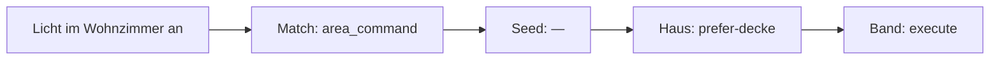

# ADR 0001 — Sichtbare Regeln, Sprach-Seeds und LLM-Trainer

[Deutsch](adr-0001-rules-and-trainer.md) · [English](adr-0001-rules-and-trainer.en.md)

Status: **akzeptierte Richtung; auf staging umgesetzt, kein Hauptrelease** — [Plan](adr-0001-plan.md).

Klar bleibt eine deterministische, lokale NLU. Ein LLM darf das Haus **einrichten**, nicht den Parse-Pfad **fahren**. Alle drei Ebenen sind in der Operator-UI **sichtbar, steuerbar und trainierbar**. Jeder Parse zeichnet denselben Pfad.

## Idee, wie wir sie verstehen

Verhalten lebt auf **drei Ebenen**, die derselbe Satz nacheinander durchläuft:

1. **Match** — *wie* Tokens zu einem Intent-Kandidaten werden (`PolicyId`: `area_command`, `grounded_entities`, `media`, …).
2. **Sprache** — zwei Samen derselben Locale: **Lexikon** (Verben/Nomina, inkl. Overlay für Slang) und **Govern-Seed** (Confirm für Schlösser). Mit dem Pack ausgeliefert.
3. **Haus** — Overlay dieses Graphen: Operator- und Trainer-Regeln, die den Seed überschreiben oder ergänzen.

Heute sind Match und Safety unsichtbar im Code, der Tab Regeln kennt nur eine leere Haus-Liste, und das Labor zeigt einen groben Prozess-Chip (`conversation.process`), aber nicht *welche Ebene warum* entschieden hat.

Gewünscht:

- Alle drei Ebenen in der Operator-UI **verwalten**: an/aus, Reihenfolge, Inhalt — plus **LLM-Vorschläge** pro Ebene.
- Dieselben drei Ebenen **scharf visualisieren**: statisch (wie sie geschichtet sind) und live (welchen Pfad *dieser* Satz genommen hat). Ein Klick auf einen Knoten öffnet die Regel.

Match bleibt kompiliert (keine frei erfundene Matching-DSL). Steuerbar heißt: Overlay auf dem Katalog (enable, Precedence), nicht neue `PolicyId`-Funktionen aus dem Modell. Jede kompilierte Assist-Locale (`GET /api/v2/languages`) ist erstklassig — de/en sind Oracles, keine Extra-Kaste.

## Ist-Zustand (knapp)

```
Text → tokenize → PolicyId-Match (starr) → Ranking
    → Overlay-PolicyRule (oft leer) + compiled_risky
    → Band: execute / confirm / clarify / reject / chat
```

| Baustein | Lücke |
|----------|--------|
| Overlay-`PolicyRule` | nur Haus, leer, kein Origin, max. 64 |
| Evaluate / Labor-`.flow` | Overlay-Treffer + `compiled_risky`; kein Ebenen-Pfad |
| `IntentCandidate.policy` | Match-Name in JSON, nicht in der Regeln-UI |
| Sprachpacks | kompiliertes Lexikon; Overlay `SetDelta` existiert, aber kaum in der Regeln-UI |
| Govern-Seeds | fehlen |
| `risky_intent` / Infra | unsichtbar |
| Trainer | fehlt |

## Strategie: drei Steuerflächen, ein Interpreter

Nicht Strategie B (Match als frei schreibbare DSL). Nicht nur Trace ohne Knöpfe.

```
Match-Katalog (kompilierte Funktionen)
  + Match-Overlay: enabled, precedence     ← UI + Trainer
       ↓ Kandidaten
Sprache: Lexikon-Pack + Lexikon-Overlay          ← UI + Trainer (add/remove Token)
       + Govern-Seed                             ← UI + Trainer (an/aus, Reset)
       ↓ erste passende Seed-Regel
Haus-Overlay                               ← UI + Trainer (volle PolicyRule)
       ↓ erste passende Haus-Regel gewinnt vor Seed
Invarianten: validate_plan, Expose, Schema (immer im Trace, kein Trainer)
```

Vorbefüllt pro Sprache sind **zwei** Samen, plus ein Overlay:

1. **Lexikon-Pack** (schon kompiliert): Verben, Nomina, Füllwörter. Das *ist* die Pre-Seed-Datenbank.
2. **Lexikon-Overlay** (schon `LanguageOverlay` / `SetDelta`): Slang, Dialekt, Hauswörter. Preview und Rollback existieren.
3. **Govern-Seed** (neu): ein sprachloses Safety-Bundle, gebunden mit **jedem** Pack.

## Schichtenvertrag

### 1. Match — Katalog plus Overlay

Jede `PolicyId` ist eine Katalogzeile. Der Operator sieht die **volle Liste** (heute ~24 Ids, Precedence 0–21), nicht nur die, die gegriffen hat.

Steuerung im Overlay, nicht in Rust:

```json
{ "id": "media", "enabled": false, "precedence": 3 }
```

| Darf | Darf nicht |
|------|------------|
| an/aus, Precedence ziehen, auf Engine-Default zurück | neue PolicyId erfinden, Matcher-Quelltext, Tokenizer/Fuzzy umschreiben |

Beispiel: Haus ohne `media_player` → `media` aus. Viele gleichnamige Lampen → `grounded_ambiguous` vor `follow_named`. Trainer schlägt genau solche Overlays vor, mit Begründung aus dem Graph.

Disabled Ids werden in `parse_clause_candidates_for_action` übersprungen. Unbekannte Ids → 400. Reset löscht die Overlay-Zeile.

### 2. Sprache — Lexikon-Datenbank plus Govern-Seed

Ein Pack, das „nicht passt“ (Slang, Dialekt, exotische Formen), wird **nicht** über `PolicyRule` repariert. Match sieht Tokens nur, wenn sie im Katalog stehen. `when.phrase = „mach die Funzel an“` skaliert nicht und umgeht das Lexikon.

Richtig: das Pack **ist** die vorbefüllte Datenbank. Sichtbar in der Spur Sprache, überschreibbar durch dasselbe Overlay, das `POST /api/lang/overlay` schon schreibt (`sets.nouns.light_nouns.add = ["funzel"]`). Trainer darf **add/remove auf bekannten Set-Pfaden**, nach Preview und Locale-Smokes.

| Darf (Lexikon) | Darf nicht |
|----------------|------------|
| Token auf existierendem Pfad ergänzen (`nouns.light_nouns`, `cues.on_words`, …) | Pack-Datei ersetzen, Morphologie/`NumberStyle`/Tokenizer ändern |
| Token aus dem Overlay wieder entfernen, Pack-Reset | `VerbKind` eines Builtin-Tokens umbiegen (Konflikt wie bei ExternalPacks) |
| Dialekt als Overlay auf `de` (nicht jedes Slang-Pack ist eine Locale) | alle Locales in einen Catalog mergen; Füllwörter, die Partikel fressen (`an`/`aus`) |

`set_field` erlaubt heute nur eine Teilmenge der Sets. Pfade für Slang bei Bedarf erweitern (weitere Nomina, Cues). Neue Verben nur als **neues** Token plus explizitem `VerbKind`; Kollision mit Builtin → ablehnen.

Govern-Seed bleibt daneben, z. B. in `src/lang/packs/de/govern.json`. Normale `PolicyRule`s, stabile Ids:

| Id | when | effect |
|----|------|--------|
| `seed:confirm-lock` | domain `lock` | `confirm` |
| `seed:confirm-cover-close` | cover + `HassTurnOff` | `confirm` |
| `seed:block-area-lock` | lock + area | `block` |

UI: Spur Sprache hat zwei Listen — **Lexikon** (Pack read-only + Overlay-Deltas) und **Govern**. Toggle/Reset am Govern wie geplant. Lexikon-Deltas sind `add`/`remove`, nicht Drag-Reihenfolge. Haus-Regel mit derselben Govern-Id **ersetzt** den Seed. Extra Haus-Regeln stehen **davor**. Seeds zählen nicht gegen die 64.

Trainer: (a) Lexikon — Tokens aus Journal/Gaps (`funzel` → `nouns.light_nouns`); (b) Govern — welche Seeds zu diesem Graph passen.

### 3. Haus — Overlay

Heutiges Bundle in `klar_nlu.json`, plus `origin` (`operator` \| `trainer`) und `replaces`. Volle `PolicyRule`-Editorik wie heute. Trainer schreibt hausgenaue Regeln (Kinder-AC blocken, „gute Nacht“ → Script, Prefer Decke).

### Invarianten

`validate_plan`, Assist-Expose, Schema bleiben. `compiled_risky` als Untergrenze: anfangs an, Trace unterscheidet Regel-`confirm` vs. Floor.

## Operator-UI: drei Spuren, ein Pfad

Der Tab Regeln wird die Steuerzentrale. Labor und Gespräche **lesen denselben Pfad**, sie editieren ihn nicht.

### Statisch — Schichtung

Drei Spalten, eine Reihenfolge, die der Runtime entspricht:

```
Match (Engine)          Sprache                  Haus
──────────────          ──────────────           ────
[on] laundry_switch 0   Lexikon overlay +2       1  Kinder-AC  block
[on] timer          1     funzel → light_nouns   2  Gute Nacht script
[off] media         3   Govern seed
[on] area_command   8     [on] seed:confirm-lock
…                       [off] seed:prefer-climate
…
Trainer für diese Spur →  Evaluate-Satz  →  Pfad unten
```

- Aktive Spur bestimmt, was Speichern / Trainer / Reset tun.
- Drag nur innerhalb der Spur (Match-Precedence, Haus-Reihenfolge). Seed-Reihenfolge kommt aus dem Pack.
- Origin-Chip: `engine` / `seed` / `operator` / `trainer`.

### Live — Pfad dieses Satzes

Evaluate und Labor ersetzen die fünf Karten (`compiled_risky`, `matched_rule`, …) durch **eine Spur mit drei Pflicht-Knoten**. Übersprungene Ebenen bleiben als Knoten stehen (`—`), sonst sieht man nicht, dass sie geprüft wurden.



Jeder Knoten:

- **Ebene** + **Id** oder `—`
- kurz warum: Score/Margin bei Match, `when`-Treffer bei Govern, `compiled_risky` nur wenn kein Seed/Haus gegriffen hat
- Klick springt in die Spur und selektiert die Zeile
- darunter Match-Verlierer (`discarded`, schon in `ParseTrace`)

Denselben `PolicyPath` in Regeln-Evaluate, Labor (heute `.flow` / `processPath`) und optional Gesprächszeile. Eine Quelle, drei Oberflächen.

Erklären-Sprache und `POST /api/lang/explain` sprechen dieselben Ids: „Match `area_command`, Haus `prefer-decke`, ausgeführt.“

## LLM-Trainer, pro Ebene

Weiterhin kein Parse-Hot-Path, keine Geräte-Tools. Operator löst **pro Spur** oder „Haus einrichten (alle Spuren)“ aus.

```
Graph + Gaps + aktuelle Overlays + Seed der Sprache + Match-Katalog
  → Vorschlag mit layer-Feld
  → sanitize + Grounding
  → Dry-Run auf Haus- und Locale-Smokes
  → Diff auf der Spur: übernehmen / ablehnen / editieren
```

| Ebene | Schema | Beispiel |
|-------|--------|----------|
| Match | `{ id, enabled, precedence? }[]` | `media` aus, weil kein Player im Graph |
| Lexikon | `{ path, add?, remove? }[]` | `nouns.light_nouns` += `funzel` |
| Seed | `{ id, enabled, prefer? }[]` | `seed:prefer-climate` auf `climate.wohnzimmer` |
| Haus | `PolicyRule[]` | Phrase „gute Nacht“ → `script.good_night` |

Das Modell darf keine neuen Match-Ids, keine neuen Effects, keine Entity-Ids außerhalb des Graphen. Prompt versioniert, HA-Fallback-LLM, Engine ohne Netz.

## Phasen

1. **Pfad + Katalog, noch starr**  
   `PolicyTrace` mit `match`, `seed`, `house`, `band`, `discarded`. Gemeinsame Pfad-Komponente in Regeln und Labor. Drei Spuren sichtbar, Match/Seed zunächst Toggle-los (read-only), Haus wie heute. Gate: Contract-Tests; Scorecard unverändert.

2. **Match- und Sprachen-Steuerung**  
   Overlay `match_controls`; Seed-Toggles; Lexikon-Deltas in derselben Spur sichtbar (API existiert). Evaluate respektiert alles. Reset-auf-Default. Parity: Defaults = heutiges Verhalten.

3. **Safety als Seed für alle Locales**  
   Ein sprachloses Govern-Bundle an jedem Pack. `compiled_risky` bleibt Floor, bis `assist_langs` + `parity_langs` halten.

4. **Trainer**  
   Context + Validate mit `language`. Tests an einer Referenz- **und** einer generierten Locale.

5. **Optional: Household-Phrasen**  
   Nur per Generator für `LangId::all()`.

Jede Stufe braucht ein eigenes PR gegen **`staging`**; der [Umsetzungsplan](adr-0001-plan.md) ist die Reihenfolge mit Dateien, Gates, Stopps und Lieferkanal. Promote auf `main` ist ein späterer, bewusster Schritt — nicht der Default. Dieses ADR bleibt die Klammer.

## Offene Punkte

1. `compiled_risky`-Untergrenze, wenn der Operator `seed:confirm-lock` ausmacht? (anfangs: Floor an)
2. Trainer nur UI oder auch Assist-Gespräch? (v1: nur UI, Vorschläge landen in der Spur)
3. Household-Phrasen in Phase 6? (später)
4. `origin: trainer` dauerhaft sichtbar? (ja)
5. Infra: Tags am Graph, Needles als Match/Seed-Hinweis, kein Freitext aus dem Modell

Neu durch die drei Spuren:

6. Darf Precedence-Ziehen Match so weit verdrehen, dass Locale-Smokes rot werden? (Evaluate warnt; Speichern erlaubt; Reset bleibt ein Klick)
7. Ein Trainer-Lauf über alle Spuren oder immer eine Spur? (UI kann beides; Apply bleibt pro Spur bestätigt)

8. Darf der Trainer Lexikon-Tokens vorschlagen, die Locale-Smokes drehen? (Preview Pflicht; Apply nur nach grünem Dry-Run oder explizitem Override)
9. Overlay-Pfade auf alle Nomina/Cues erweitern, oder Verben weiter nur über ExternalPack? (Empfehlung: Nomina/Cues erweitern; Verben nur neue Tokens)

## Folgen

- Tab Regeln ist die Wahrheit für alle drei Ebenen; Labor und Gespräche zeigen denselben Pfad.
- Flexibilität sitzt auf **Overlays** (Match-Controls, Lexikon-`SetDelta`, Seed-Toggles, Haus-Regeln), nicht auf einer Matching-DSL.
- Der Trainer hat enge Schemas pro Spur und denselben Dry-Run wie der Mensch.
- Defaults bleiben das heutige Assist-Verhalten, bis jemand eine Spur ändert.

## Verweise

- Overlay-Regeln: `src/types/policy.rs`, `src/nlu/policy_route.rs`, `src/io/policies.rs`
- Match-Policies: `src/parse/policy.rs`, `src/parse/clause.rs`
- Safety: `src/nlu/draft.rs` `safety_decision`, `src/nlu/validation.rs` `risky_intent`
- Labor-Pfad (heute): `web/src/pages/ParsePage.tsx` (`.flow`, `processPath`)
- Lexikon-Overlay: `src/lang/user.rs`, `src/io/lang_api.rs` (`/api/lang/overlay`, preview, rollback)
- API: [API](../api.md) (`/api/v2/policies`, `/api/v2/policies/evaluate`, `/api/lang/overlay`)
