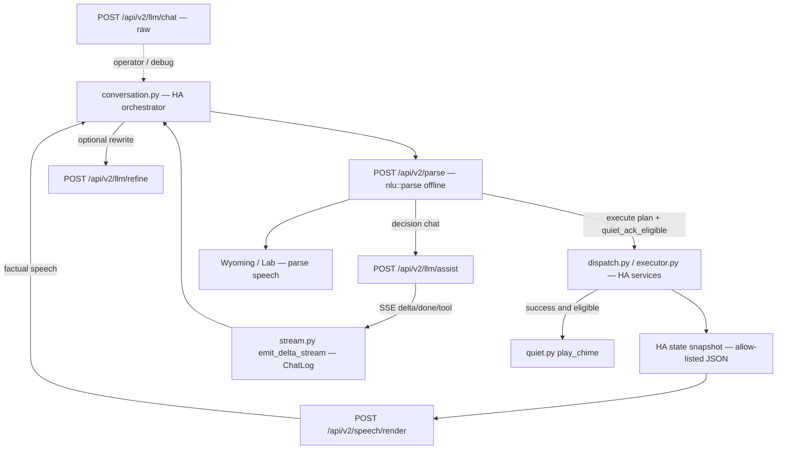

# Implementation plan — ADR 0003

[Deutsch](adr-0003-plan.md) · [English](adr-0003-plan.en.md)

Frame: [ADR 0003](adr-0003-python-rust-boundary.en.md). Each stage is its own PR **against `staging`**. Engine + integration ship together on the staging channel. No calendar — order follows dependencies and risk.

This plan does **not** implement the moves. It is the worklist after a Python-vs-Rust ownership review, checked against the tree at the time of writing.

## Delivery channel: staging, not a main release

Same channel as [ADR 0001](adr-0001-plan.en.md):

| What | Decision |
|------|----------|
| Base of every implementation PR | `staging` (protected, merge via PR) |
| This ADR/plan PR | `staging` as well, **docs-only**. Do not hijack other RCs. |
| Implementation PRs that touch `conversation.py` | sequential PRs vs current `staging` (operator-UI RC [#205](https://github.com/FABBricate-IT-Solutions/klar-ha-nlu/pull/205) has landed) |
| After merge to `staging` | existing staging workflow: prerelease `{CalVer}-staging.{sha7}`, image tag `staging`, never `latest` |
| `staging` → `main` | **not** part of this plan |
| Tests | Always `cargo nextest`, never `cargo test`. No `--admin`. |

## Goal / non-goals

**Goal.** Move Assist **product logic** that is not Home Assistant platform glue into the Klar engine, without putting a model or network on `nlu::parse`, and without Assist double-speaking or dropping personality during the rollout.

**Non-goals.**

- Rewrite `scripts/lang_packs/` in Rust (keep Python codegen; extend emitters).
- Rewrite `conversation.py` as a Rust HA plugin. It stays ConversationEntity / ChatLog orchestrator.
- Port `engine.py`, `config_flow.py`, `sync.py`, `dispatch.py`, `executor.py`, `dispatch_media.py`, `play_chime`, panel/services/entities.
- Delete `contracts.py` `validate_v2_payload` (client schema guard).
- “Clean up” `intents.py` `_fold_latin` / `_umlaut_eq` into a shared crate. Freeze; do not grow. Area resolve vs the HA registry stays glue. Canonical fold is `src/parse/normalize.rs`.
- New `PolicyId` matchers, trainer DSL, or LLM-inside-parse (ADR 0001 / 0002).
- Promote this cycle to `main`.

## Review vs the tree (corrections)

The review was **right** on the worklist and on LOC shape (`custom_components/klar_nlu/` = 8468 lines; `scripts/lang_packs/` = 11795). Product modules to move are roughly a third of the integration by conceptual size (`refine.py` 548, `refine_voices.py` 357, `fallback.py` 410, `rag_tools.py` 90, `speech.py` 511, `speech_status.py` 333, `speech_place.py` 101, `speech_status_device.py` 68, `calendar_say.py` 289, `clock_speech.py` 42, `floor_query.py` 177, plus `quiet_ack_applies`). `speech_locale.py` is a **generated** few-line blob from `scripts/lang_packs/generate.py` `write_speech_locale`, not hand-written product code.

Corrections and splits the review understated:

1. **ADR 0002 is violated in three places, not two.** Besides `refine.py` `_async_refine_raw` (engine `complete_engine_chat` → `client.chat.completions.create` → `conversation.async_converse`) and `stream.py` `iter_completion_tokens`, **`conversation.py` `_fallback` / `_stream_fallback`** is the same three-tier path for Yarn/chat/RAG (`stream_engine_chat` → `stream_chat` SDK → `async_converse`). `tests/ha/test_conversation_fallback.py` currently **asserts** that `stream_chat` appears in `_fallback`. PR 1 must update those source-inspection tests.
2. **`stream.py` is two modules in one file.** Keep `iter_token_deltas` / `emit_delta_stream` (HA ChatLog glue). Only `iter_completion_tokens` / `stream_chat` are the parallel SDK. Do not move ChatLog code into Rust.
3. **`agent_has_home_control` stays Python.** It reads `ConversationEntityFeature.CONTROL`. The *prompt text* (“you may use tools” vs chat-only) moves; the feature bit does not.
4. **`quiet_ack_applies` cannot be parse-only.** It requires `executed.outcome == success` and a single successful step. Engine may flag `quiet_ack_eligible` from the plan (offline). Python still gates on dispatch success, then `play_chime`.
5. **Weather invention is duplicated.** `refine.py` `_invents_weather` / `_weather_claim` and `fallback.py` `weather_claim` share almost the same word list. One engine helper; both refine-accept and `keeps_calendar_reply` use it.
6. **Dual speech sources already exist.** `respond.rs` (parse / Wyoming) vs `speech.py` (Assist after HA intent). Comment in `respond.rs` lines 15–17 is accurate. The renderer must not TTS both. Assist already overwrites parse speech after execute.
7. **Clock and climate are live.** `clock_speech.py` uses HA `dt_util.now()`. `speech.py` `_state_value` / `speech_status.py` read `current_temperature`. MASS reads `media_title`, `volume_level`, `is_volume_muted`. The home graph is not a substitute. Snapshot first, then templates.
8. **Personality is applied at Assist finish**, not in `from_handled`. Post-exec Python speech is the factual line; `async_finish_speech` then `style()` or refine. Engine render must return the factual sentence only, or Assist will double-prefix.

## Target architecture



After the work:

| Who | Owns |
|-----|------|
| Engine | Parse, packs, refine accept+prompt, Assist system prompts, RAG protocol parse, post-exec templates, quiet-ack eligibility |
| Python | Process, config, registry, HA execute, snapshot **build**, ChatLog deltas, `async_converse` legacy, chime playback |
| Generator (Python) | Emit pack speech (including new post-exec keys) for every compiled locale; de/en handwritten |

## API contracts

`schema_version` on parse stays `"2.0"`. New bodies use their own small versions. Write token required off-loopback, same as overlay / `llm/chat`.

Parse path **unchanged in role**: no LLM, no snapshot, no post-exec render.

### Additive on `ParseOutcome` (PR 6; optional in PR 1 unused)

```json
{ "quiet_ack_eligible": true }
```

`skip_serializing_if` default false is fine as `false` when not execute or not a simple on/off. `validate_v2_payload` in Python must allow the optional key (client guard stays).

### Keep — `POST /api/v2/llm/chat`

Raw messages. No `purpose` field. Do not overload this with Assist product prompts.

### New — `POST /api/v2/llm/refine`

```json
{
  "speech": "Wohnzimmer Licht ist an.",
  "language": "de",
  "personality": "butler",
  "extra_prompt": "",
  "stream": false
}
```

Response (non-stream): `{ "type": "done", "text": "Das Licht im Wohnzimmer ist an.", "accepted": true }`. If accept rejects, `text` is the original and `accepted` is false (HA then `style()` as today). `503` = no endpoint. Caps: `speech` ≤ 4096, `extra_prompt` ≤ 2048. Engine builds `refine_prompt` from pack + `refine_voices` blocks + extra; runs the model with today’s refine temperature / max_tokens (0.65 / 128); runs `accept_refined` (digits, no new number-words, no intent names, no weather invention, no stamp ban, length, no ellipsis, no new question).

Do **not** send a Python-built system prompt on this route.

### New — `POST /api/v2/llm/assist`

```json
{
  "text": "erzähl einen Witz",
  "language": "de",
  "personality": "butler",
  "kind": "auto",
  "allow_tools": false,
  "nlu_rag": false,
  "retrieval": null,
  "facts": null,
  "history": [["user", "…"], ["assistant", "…"]],
  "extra_system": null,
  "stream": true
}
```

`kind`: `auto` | `yarn` | `chat` | `rag` | `calendar` | `news` | `news_follow`. `auto` uses engine `yarn_request` / RAG flag. `facts` is headline list or calendar readback already gathered by HA. `history` is the short LLM turn list (`append_llm_turn`, keep 8).

SSE events (same envelope as chat, plus tool):

```json
{"type":"delta","text":"…"}
{"type":"done","text":"…"}
{"type":"error","message":"…"}
{"type":"tool","tool":"klar.parse","text":"licht an"}
{"type":"tool","tool":"klar.act","intent":"HassTurnOn","slots":{"entity_id":"light.kugel"}}
```

Engine holds the stream while a `KLAR_` prefix is incomplete (`holds_klar_tool_prefix`). Python today does that in `stream.py` `hold`. Move the hold decision to the engine or keep hold in Python **only** if the engine still emits raw prefixes; prefer structured `tool` events so TTS never speaks `KLAR_PARSE:`.

Yarn permission-ask: engine retries with `yarn_nudge` or returns canned (`yarn_canned`) — product rule, not HA.

### New — `POST /api/v2/speech/render`

```json
{
  "schema_version": "1",
  "language": "de",
  "personality": "default",
  "now": "2026-09-05T19:22:00+02:00",
  "intent": {
    "name": "HassTurnOn",
    "slots": [{"name": "area", "value": "wohnzimmer"}, {"name": "domain", "value": "light"}]
  },
  "outcome": "success",
  "entities": [
    {
      "entity_id": "light.wohnzimmer",
      "name": "Wohnzimmer",
      "domain": "light",
      "state": "on",
      "area": "wohnzimmer",
      "area_name": "Wohnzimmer",
      "device_class": null,
      "attributes": {
        "current_temperature": null,
        "temperature_unit": null,
        "unit_of_measurement": null,
        "hvac_action": null,
        "hvac_mode": null,
        "volume_level": null,
        "is_volume_muted": null,
        "media_title": null,
        "media_artist": null,
        "media_album_name": null
      }
    }
  ],
  "calendar_events": [],
  "media_queue": []
}
```

Response: `{ "speech": "Licht im Wohnzimmer ist an.", "quiet_ack": false, "source": "post_execute" }`.

Caps: 32 entities, 16 calendar events, 8 queue titles, attribute values ≤ 256 chars, unknown attribute keys dropped. `now` is required for clock lines. `outcome` `error` uses existing failure copy (Python `executor.py` maps error ids today — keep those strings in packs when moving).

HA **builds** the snapshot from `hass.states`, intent `handled` / MASS response, and calendar rows. Engine only interpolates templates. Do not send raw `State` objects.

`POST /api/v2/home` is not this.

## PR sequence

Do not open implementation PRs against leftover feature branches. Stack on current `staging`.

Rollback pattern for every move: if the new route returns 404/503, Python keeps the previous function for one staging bake, then a follow-up commit in the **next** PR deletes it. No long-lived dual source of truth.

### PR 0 — this document (docs-only)

**Title:** `docs: ADR 0003 Python/Rust Assist product-logic boundary`

**Files:** `docs/architecture/adr-0003-*.md`, links from `docs/architecture.md`, `docs/en/architecture.md`, see-also on ADR 0002.

**Tests:** none required (docs).

**Depends on:** nothing. Merge vs `staging` while #205 is in flight.

---

### PR 1 — Engine-only LLM transport (ADR 0002 remaining)

**Title:** `fix: stop using the HA OpenAI SDK on Assist LLM paths`

**Intent:** New/current paths = engine only. `async_converse` only when an old agent is configured **and** engine chat is unavailable (503 / no endpoint). Do not grow SDK paths.

**Files likely touched:**

- `custom_components/klar_nlu/refine.py` — `_async_refine_raw`: keep `complete_engine_chat`, then `async_converse`; delete `client.chat.completions.create`.
- `custom_components/klar_nlu/conversation.py` — `_fallback`: keep `stream_engine_chat`, then `async_converse`; delete `_stream_fallback` / `stream_chat`.
- `custom_components/klar_nlu/stream.py` — keep `iter_token_deltas`, `emit_delta_stream`; stop calling `iter_completion_tokens` from Assist. Leave the SDK iterator unexported or delete if unused.
- `custom_components/klar_nlu/refine.py` `llm_client_and_model` — only if `async_converse` still needs agent lookup; do not use it to call `chat.completions.create`.
- `tests/ha/test_conversation_fallback.py` — drop the `stream_chat` assertion; keep `stream_engine_chat` then converse.
- `tests/ha/test_stream.py`, `tests/ha/test_refine.py`, `tests/ha/test_engine_llm.py`.

**Tests:** `tests/ha/test_refine.py`, `test_engine_llm.py`, `test_conversation_fallback.py`, `test_stream.py`. No `cargo nextest` parse matrix (Python-only).

**Rollback / flag:** none. 503 → `async_converse` is the rollback. Operator UI must have the engine LLM endpoint (ADR 0002).

**Depends on:** PR 0 (docs). `conversation.py` is on current `staging` after #205.

---

### PR 2 — Engine-owned refine accept and prompt

**Title:** `feat: build refine prompts and accept_refined on the engine`

**Intent:** HTTP already uses `/api/v2/llm/chat`. Accept + prompt builder become engine-owned. Personality blocks move from `refine_voices.py` / generated `REFINE_SHOTS`.

**Files likely touched:**

- `src/io/llm.rs` — route `POST /api/v2/llm/refine`.
- `src/llm/` — prompt builder, `accept_refined`, weather/number/stamp guards (no `LangId` match in `src/parse/`; pack copy from language packs / a prompt table generated for all locales, de/en oracle).
- `scripts/lang_packs/` — emit refine voice blocks for generated locales (do not rewrite the generator).
- `custom_components/klar_nlu/refine.py` — `async_refine_speech` calls `/llm/refine`; keep local `accept_refined` as 404 fallback this cycle.
- `custom_components/klar_nlu/engine_llm.py` — typed helper.
- `docs/en/api.md`, `docs/api.md`.
- Tests: `tests/ha/test_refine.py` fixtures ported to Rust unit tests + HA still checks glue.

**Tests:** `cargo nextest run --locked` for new llm/refine unit tests (no live model). `tests/ha/test_refine.py` (accept fixtures must stay bit-identical: weather invention, digits vs number-words, stamp ban, clock seconds, clarify stays a question). `test_engine_llm.py`.

**Rollback:** 404 → Python `accept_refined` + `complete_engine_chat` with Python prompt (today’s path after PR 1).

**Depends on:** PR 1 (otherwise SDK still bypasses engine accept).

**Locale:** generated packs get meta/en fallback prompts until the generator emits per-locale rules (existing `refine_voices.py` `_RULES["meta"]` pattern). de/en stay oracles. A de/en-only prompt table is **not** done.

---

### PR 3 — Engine-owned fallback / Yarn / RAG prompts

**Title:** `feat: engine-owned Assist fallback prompts and RAG protocol`

**Intent:** Classification + system prompts → Rust. HA gathers facts (headlines, calendar speech, retrieval already on parse) and streams deltas only.

**Files likely touched:**

- `src/io/llm.rs` — `POST /api/v2/llm/assist`.
- `src/llm/` — `yarn_request`, `chat_only_prompt`, news/calendar prompts, RAG instruct, protocol parse, canned yarn, weather_claim (shared with PR 2).
- `custom_components/klar_nlu/conversation.py` — `_fallback` / `_briefing` / calendar LLM: POST assist with `kind` or `auto`; handle `tool` events → existing `_klar_tool_turn` execute path.
- `custom_components/klar_nlu/fallback.py`, `rag_tools.py` — 404 fallback this cycle.
- `tests/ha/test_fallback.py`, `test_rag_tools.py`, `test_conversation_fallback.py`, `test_script_languages.py` (chat_only_prompt per locale).

**Tests:** Rust unit tests for yarn/joke/story, protocol parse, weather_claim, calendar `keeps_calendar_reply`. HA: `test_fallback.py`, `test_rag_tools.py`, `test_conversation_fallback.py`, `test_engine_llm.py`. `cargo nextest run --locked --test contract` if ChatEvent grows a `tool` variant.

**Rollback:** 404 → Python prompt assembly + `stream_engine_chat` (PR 1 path).

**Depends on:** PR 1. Can land after PR 2; do not parallelize on `src/io/llm.rs` / `ChatEvent` without stacking.

**Migration:** HA must **stop** sending a prebuilt system prompt once this route is used, or the model gets personality twice (`refine_prompt` already prepended in `_fallback` today). One voice: engine `with_personality` only.

---

### PR 4 — Post-execute speech snapshot contract

**Title:** `feat: HA state snapshot contract for post-execute speech`

**Intent:** Contract only. Python still renders via `speech.py`. Engine validates the body and may echo a stub or return `501`/`{"source":"python"}` until PR 5. Goal: freeze the JSON so PR 5 is templates, not a second schema fight.

**Files likely touched:**

- `src/types/` — `SpeechSnapshot` (keep files under 500 lines).
- `src/io/` — `POST /api/v2/speech/render` validates caps/allow-list; does not interpolate yet (or returns empty `speech` + `source: "unrendered"`).
- `custom_components/klar_nlu/` — snapshot builder from `hass.states` / handled / MASS queue / calendar rows / `dt_util.now()`; tests only (Assist still calls `from_handled`).
- `custom_components/klar_nlu/contracts.py` — optional client-side snapshot guard (same idea as `validate_v2_payload`; OK to add, do not replace engine validation).
- `docs/en/api.md`, `docs/api.md`, this ADR if the allow-list shifts.
- Tests: `tests/contract.rs` or dedicated speech-contract test; `tests/ha/test_speech.py` snapshot-shape tests.

**Tests:** `cargo nextest run --locked --test contract`. Reject unknown attrs vs drop: **drop unknown keys**, reject missing `schema_version` / over-cap. `tests/ha/test_speech.py`.

**Rollback:** unused route; Assist behavior unchanged.

**Depends on:** PR 0. Independent of PR 2–3. May land parallel to PR 1 if it does not touch `conversation.py`.

---

### PR 5 — Engine post-execute renderer + pack templates

**Title:** `feat: render Assist speech from the HA state snapshot`

**Intent:** Templates in language packs. Generator emits new keys for **every** compiled locale (same rule as ADR 0001). de/en handwritten. Assist calls `/speech/render` after successful (or failed) execute; uses returned `speech` instead of `from_handled`.

**Files likely touched:**

- `src/lang/speech.rs` — new fields (query/area status, media now-playing, clock, floor, calendar say). Split types if the struct grows past the file budget.
- `src/lang/packs/*/speech.rs`, `scripts/lang_packs/emit.py` `speech_rs`, `scripts/lang_packs/voices.py`.
- `src/parse/` must **not** grow a `match LangId`. Renderer lives under `src/speech/` or `src/lang/` interpolation, called from `src/io/`.
- `custom_components/klar_nlu/dispatch.py`, `dispatch_media.py`, `executor.py` — build snapshot, POST render, 404 → `from_handled`.
- `tests/ha/test_speech.py`, `test_floor_query.py`, `test_calendar.py`, `test_dispatch.py`.
- `cargo nextest`: `assist_langs` only if parse speech strings change; **parity** if pack speech fields change. Prefer keeping `respond.rs` parse templates stable in this PR so parse oracles do not move.

**Tests:** Port `test_speech.py` cases to Rust with **fixture snapshots** (no HA). HA tests: builder + 404 fallback. `cargo nextest run --locked` for speech unit tests + `assist_langs` if parse templates were touched (they should not be).

**Rollback / flag:** 404/empty → `speech.py`. Optional integration option `engine_speech_render` default **on** for staging once fixtures match; off restores Python. Prefer 404 fallback over a new HA option if the staging pair always updates together.

**Depends on:** PR 4.

**Do not:** interpolate from `HomeGraph` alone for climate/MASS/query. If a field is missing on the snapshot, say the unknown/unavailable line — do not invent a temperature.

---

### PR 6 — quiet_ack eligibility on the plan

**Title:** `feat: flag quiet_ack_eligible on execute plans`

**Intent:** Product rule in Rust: one successful on/off on light/switch → chime. Flag on parse/execute outcome. `play_chime` stays Python.

**Files likely touched:**

- `src/types/outcome.rs` — optional `quiet_ack_eligible`.
- `src/nlu/draft.rs` or plan finalize — derive from single-step `HassTurnOn`/`HassTurnOff` + domain/entity prefix in `{light,switch}` and not in `{scene,script,cover,lock,climate,fan,media_player,vacuum}` (same as `quiet.py` `SIMPLE_*` / `BLOCKED_*`).
- `custom_components/klar_nlu/contracts.py` — allow the key.
- `custom_components/klar_nlu/conversation.py` — `quiet_ack_applies` uses engine flag **and** executed success; keep Python function as 404/old-engine fallback.
- `tests/ha/test_quiet.py`, contract tests.

**Tests:** `cargo nextest run --locked --test contract --test assist_langs` (additive JSON; scorecard unchanged). `tests/ha/test_quiet.py`.

**Rollback:** missing key → today’s `quiet_ack_applies(executed, plan)`.

**Depends on:** PR 0. Independent of PR 2–5. May ship in parallel with 2–5.

---

### Follow-up (done)

After the staging bake of PRs 1–6: Python duplicates are deleted (`accept_refined`, prompt dicts, `from_handled` templates, `quiet_ack_applies` domain body). Missing engine routes fail closed. Fold helpers in `intents.py` carry freeze comments. Mixed old-engine / new-integration pairs skip refine, Assist prompts, and post-execute interpolation rather than invent a second source of truth.

## Migration strategy (no double-speak, no dropped personality)

1. **One LLM hop per turn.** PR 1 removes SDK so engine SSE and `async_converse` cannot both publish. Keep `skip_rewrite` for `chat` / `llm` / `chime` / `error` — fallback already applied the voice; a second refine rewrites after TTS started (`refine.py` `skip_rewrite`).
2. **One system prompt.** When `/llm/assist` builds personality, HA must not also prepend `refine_prompt`. `_fallback` sends `extra_prompt` (operator option) and `extra_system` (user/policy extra), not a Python-built product prompt.
3. **One spoken line after execute.** Assist continues to **replace** parse speech with post-exec speech. Do not TTS `respond.rs` and `speech/render`. Wyoming/Lab keep parse speech.
4. **Personality prefix once.** Renderer returns the factual sentence. `async_finish_speech` applies `style()` or `/llm/refine`. Do not wrap in the renderer.
5. **Quiet ack vs TTS.** Eligible + success → empty speech + `play_chime` (today). Engine flag must not also return a spoken ack.
6. **Version skew.** Staging image = engine + integration. Missing routes fail closed (no Python product duplicate).
7. **Other RCs.** Docs PR is independent. Implementation that touches `conversation.py` stacks on current `staging`, not on leftover feature branches.

## Risks

| Risk | Why | Mitigation |
|------|-----|------------|
| Live climate / MASS attributes | `current_temperature`, `media_title`, `volume_level`, HVAC mode are not on the home graph | Snapshot allow-list (PR 4) before templates (PR 5). Missing attr → unavailable copy, never invent |
| Dual speech sources | `respond.rs` vs Assist overwrite already | Keep overwrite; renderer is the Assist source only |
| Refine hallucination | Weather/numbers/stamps/`Hass*` names | Port `test_refine.py` fixtures bit-identically; reject ≠ pass-through original |
| Calendar weather bleed | `keeps_calendar_reply` vs refine weather list drift | One `weather_claim` in the engine |
| Double personality | Prompt move + `style()` + parse wrap | Finish-time wrap only; assist route owns prompt |
| Hold / RAG leak | `KLAR_PARSE:` spoken or tools named | Structured `tool` events; keep leak sanitizer in HA until proven |
| Locale holes | Python has large per-locale tables (`speech_status`, `calendar_say`); Rust `Speech` is smaller | Generator for **all** packs in the same PR; de/en oracles; no de/en-only ship |
| `test_conversation_fallback.py` source asserts | Brittle string tests will fail when prompts leave Python | Update those tests in the same PR as the move |
| File size | `speech.rs` / snapshot types can blow the 500-line budget | Split `src/speech/` early |

## Explicitly will not do

- Rewrite `scripts/lang_packs/` into Rust
- Rewrite `conversation.py` as a Rust Home Assistant plugin
- Port `engine.py`, `config_flow.py`, `sync.py`, dispatch/executor, `play_chime`, panel/services
- LLM or I/O inside `nlu::parse`
- Aggressive dedupe of `validate_v2_payload` or `intents.py` fold helpers
- Hijack unrelated feature branches for this work
- `cargo test` or `--admin` merge
- `staging` → `main` as part of this cycle

## Order

```
0 docs (this PR)
  → 1 engine-only transport
  → 2 refine accept+prompt
  → 3 assist prompts + RAG protocol
4 snapshot contract   (parallel with 1 if it does not touch conversation.py)
  → 5 speech renderer + generator
6 quiet_ack_eligible  (parallel with 2–5)
  → cleanup delete Python duplicates (done)
```

Stop and revert if: Assist double-speaks, personality drops on refine-off houses, `assist_langs` goes red because parse templates drifted, a stage ships de/en-only prompts or speech keys, the SDK path grows again, or someone puts HA state fetches in `nlu::parse`.
