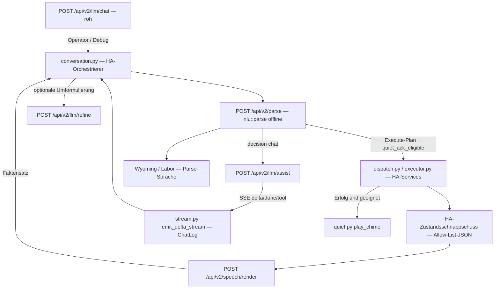

# Umsetzungsplan — ADR 0003

[Deutsch](adr-0003-plan.md) · [English](adr-0003-plan.en.md)

Rahmen: [ADR 0003](adr-0003-python-rust-boundary.md). Jede Stufe ist ein eigenes PR **gegen `staging`**. Engine und Integration kommen gemeinsam auf dem Staging-Kanal. Kein Kalender — Abhängigkeit und Risiko steuern die Reihenfolge.

Dieser Plan **implementiert** die Umzüge nicht. Er ist die Worklist nach einem Python-vs-Rust-Review, gegen den Baum zum Zeitpunkt der Niederschrift geprüft.

## Lieferkanal: Staging, kein Hauptrelease

Gleicher Kanal wie [ADR 0001](adr-0001-plan.md):

| Was | Festlegung |
|-----|------------|
| Basis jedes Umsetzungs-PRs | `staging` (geschützt, per PR mergen) |
| Dieses ADR-/Plan-PR | ebenfalls `staging`, **nur Docs**. Andere RCs nicht kapern. |
| Umsetzungs-PRs, die `conversation.py` anfassen | sequenzielle PRs gegen aktuelles `staging` (Operator-UI-RC [#205](https://github.com/FABBricate-IT-Solutions/klar-ha-nlu/pull/205) ist gemergt) |
| Nach Merge auf `staging` | bestehender Staging-Workflow: Prerelease `{CalVer}-staging.{sha7}`, Image-Tag `staging`, nie `latest` |
| `staging` → `main` | **nicht** Teil dieses Plans |
| Tests | Immer `cargo nextest`, nie `cargo test`. Kein `--admin`. |

## Ziel / Nicht-Ziele

**Ziel.** Assist-**Produktlogik**, die nicht Home-Assistant-Plattformkleber ist, in die Klar-Engine holen — ohne Modell oder Netz auf `nlu::parse`, und ohne dass Assist in der Teilauslieferung doppelt spricht oder die Persönlichkeit verliert.

**Nicht-Ziele.**

- `scripts/lang_packs/` in Rust neu schreiben (Python-Codegen behalten; Emitter erweitern).
- `conversation.py` als Rust-HA-Plugin neu schreiben. Es bleibt ConversationEntity-/ChatLog-Orchestrierer.
- `engine.py`, `config_flow.py`, `sync.py`, `dispatch.py`, `executor.py`, `dispatch_media.py`, `play_chime`, Panel/Services/Entities portieren.
- `contracts.py` `validate_v2_payload` löschen (Client-Schema-Wächter).
- `intents.py` `_fold_latin` / `_umlaut_eq` in eine gemeinsame Crate „aufräumen“. Einfrieren; nicht wachsen. Area-Resolve gegen die HA-Registry bleibt Kleber. Kanonisches Fold ist `src/parse/normalize.rs`.
- Neue `PolicyId`-Matcher, Trainer-DSL oder LLM-im-Parse (ADR 0001 / 0002).
- Diesen Zyklus nach `main` heben.

## Review gegen den Baum (Korrekturen)

Das Review lag bei der Worklist und der LOC-Form **richtig** (`custom_components/klar_nlu/` = 8468 Zeilen; `scripts/lang_packs/` = 11795). Die zu ziehenden Produktmodule sind grob ein Drittel der Integration nach konzeptioneller Größe (`refine.py` 548, `refine_voices.py` 357, `fallback.py` 410, `rag_tools.py` 90, `speech.py` 511, `speech_status.py` 333, `speech_place.py` 101, `speech_status_device.py` 68, `calendar_say.py` 289, `clock_speech.py` 42, `floor_query.py` 177, plus `quiet_ack_applies`). `speech_locale.py` ist ein **generiertes** paarzeiliges Blob aus `scripts/lang_packs/generate.py` `write_speech_locale`, kein handgeschriebenes Produktmodul.

Korrekturen und Schnitte, die das Review unterschätzt hat:

1. **ADR 0002 ist an drei Stellen verletzt, nicht zwei.** Neben `refine.py` `_async_refine_raw` (Engine `complete_engine_chat` → `client.chat.completions.create` → `conversation.async_converse`) und `stream.py` `iter_completion_tokens` ist **`conversation.py` `_fallback` / `_stream_fallback`** derselbe Dreistufenpfad für Yarn/Chat/RAG (`stream_engine_chat` → `stream_chat` SDK → `async_converse`). `tests/ha/test_conversation_fallback.py` **assertet** derzeit, dass `stream_chat` in `_fallback` vorkommt. PR 1 muss diese Source-Inspektions-Tests anpassen.
2. **`stream.py` sind zwei Module in einer Datei.** `iter_token_deltas` / `emit_delta_stream` behalten (HA-ChatLog-Kleber). Nur `iter_completion_tokens` / `stream_chat` sind das parallele SDK. ChatLog-Code nicht nach Rust ziehen.
3. **`agent_has_home_control` bleibt Python.** Es liest `ConversationEntityFeature.CONTROL`. Der *Prompttext* („du darfst Werkzeuge nutzen“ vs. nur Chat) wandert; das Feature-Bit nicht.
4. **`quiet_ack_applies` kann nicht nur Parse sein.** Es braucht `executed.outcome == success` und einen erfolgreichen Schritt. Die Engine darf `quiet_ack_eligible` aus dem Plan flaggen (offline). Python gated weiter auf Dispatch-Erfolg, dann `play_chime`.
5. **Wetter-Erfindung ist dupliziert.** `refine.py` `_invents_weather` / `_weather_claim` und `fallback.py` `weather_claim` teilen fast dieselbe Wortliste. Ein Engine-Helfer; Refine-Accept und `keeps_calendar_reply` nutzen ihn.
6. **Zwei Sprachquellen gibt es schon.** `respond.rs` (Parse / Wyoming) vs `speech.py` (Assist nach HA-Intent). Kommentar in `respond.rs` Zeilen 15–17 stimmt. Der Renderer darf nicht beide TTS-en. Assist überschreibt Parse-Sprache nach dem Execute bereits.
7. **Uhr und Klima sind live.** `clock_speech.py` nutzt HA `dt_util.now()`. `speech.py` `_state_value` / `speech_status.py` lesen `current_temperature`. MASS liest `media_title`, `volume_level`, `is_volume_muted`. Der Home-Graph ist kein Ersatz. Zuerst Schnappschuss, dann Vorlagen.
8. **Persönlichkeit kommt am Assist-Finish**, nicht in `from_handled`. Post-Exec-Python-Sprache ist der Faktensatz; `async_finish_speech` macht danach `style()` oder Refine. Engine-Render muss den Faktensatz liefern, sonst doppeltes Präfix.

## Zielarchitektur



Nach der Arbeit:

| Wer | Besitzt |
|-----|---------|
| Engine | Parse, Packs, Refine-Accept+Prompt, Assist-Systemprompts, RAG-Protokoll, Vorlagen nach dem Execute, Quiet-Ack-Eignung |
| Python | Prozess, Config, Registry, HA-Execute, Schnappschuss **bauen**, ChatLog-Deltas, `async_converse`-Legacy, Chime |
| Generator (Python) | Pack-Sprache emittieren (inkl. neuer Post-Exec-Keys) für jede kompilierte Locale; de/en handgeschrieben |

## API-Verträge

`schema_version` am Parse bleibt `"2.0"`. Neue Bodies haben eigene kleine Versionen. Write-Token off-Loopback, wie Overlay / `llm/chat`.

Parse-Pfad **unverändert in der Rolle**: kein LLM, kein Schnappschuss, kein Render nach dem Execute.

### Additiv an `ParseOutcome` (PR 6; optional in PR 1 ungenutzt)

```json
{ "quiet_ack_eligible": true }
```

`skip_serializing_if` Default false ist als `false` in Ordnung, wenn nicht Execute oder kein einfaches An/Aus. `validate_v2_payload` in Python muss den optionalen Key erlauben (Client-Wächter bleibt).

### Behalten — `POST /api/v2/llm/chat`

Rohe Messages. Kein `purpose`-Feld. Assist-Produktprompts nicht hier überladen.

### Neu — `POST /api/v2/llm/refine`

```json
{
  "speech": "Wohnzimmer Licht ist an.",
  "language": "de",
  "personality": "butler",
  "extra_prompt": "",
  "stream": false
}
```

Antwort (ohne Stream): `{ "type": "done", "text": "Das Licht im Wohnzimmer ist an.", "accepted": true }`. Lehnt Accept ab, ist `text` das Original und `accepted` false (HA macht dann `style()` wie heute). `503` = kein Endpoint. Caps: `speech` ≤ 4096, `extra_prompt` ≤ 2048. Die Engine baut `refine_prompt` aus Pack + `refine_voices`-Blöcken + Extra; fährt das Modell mit heutiger Refine-Temperatur / max_tokens (0,65 / 128); fährt `accept_refined` (Ziffern, keine neuen Zahlwörter, keine Intent-Namen, keine Wetter-Erfindung, kein Stempel-Bann, Länge, keine Auslassungspunkte, keine neue Frage).

Auf dieser Route **keinen** in Python gebauten Systemprompt schicken.

### Neu — `POST /api/v2/llm/assist`

```json
{
  "text": "erzähl einen Witz",
  "language": "de",
  "personality": "butler",
  "kind": "auto",
  "allow_tools": false,
  "nlu_rag": false,
  "retrieval": null,
  "facts": null,
  "history": [["user", "…"], ["assistant", "…"]],
  "extra_system": null,
  "stream": true
}
```

`kind`: `auto` | `yarn` | `chat` | `rag` | `calendar` | `news` | `news_follow`. `auto` nutzt Engine-`yarn_request` / RAG-Flag. `facts` ist die Headline-Liste oder das Kalender-Readback, das HA schon geholt hat. `history` ist die kurze LLM-Turn-Liste (`append_llm_turn`, Keep 8).

SSE-Events (gleiche Hülle wie Chat, plus Tool):

```json
{"type":"delta","text":"…"}
{"type":"done","text":"…"}
{"type":"error","message":"…"}
{"type":"tool","tool":"klar.parse","text":"licht an"}
{"type":"tool","tool":"klar.act","intent":"HassTurnOn","slots":{"entity_id":"light.kugel"}}
```

Die Engine hält den Stream, solange ein `KLAR_`-Präfix unvollständig ist (`holds_klar_tool_prefix`). Python tut das heute in `stream.py` `hold`. Hold-Entscheidung in die Engine oder Hold in Python **nur**, wenn die Engine weiter Rohpräfixe sendet; strukturierte `tool`-Events sind besser, damit TTS nie `KLAR_PARSE:` spricht.

Yarn-Erlaubnisfrage: Engine retried mit `yarn_nudge` oder liefert Dose (`yarn_canned`) — Produktregel, nicht HA.

### Neu — `POST /api/v2/speech/render`

```json
{
  "schema_version": "1",
  "language": "de",
  "personality": "default",
  "now": "2026-09-05T19:22:00+02:00",
  "intent": {
    "name": "HassTurnOn",
    "slots": [{"name": "area", "value": "wohnzimmer"}, {"name": "domain", "value": "light"}]
  },
  "outcome": "success",
  "entities": [
    {
      "entity_id": "light.wohnzimmer",
      "name": "Wohnzimmer",
      "domain": "light",
      "state": "on",
      "area": "wohnzimmer",
      "area_name": "Wohnzimmer",
      "device_class": null,
      "attributes": {
        "current_temperature": null,
        "temperature_unit": null,
        "unit_of_measurement": null,
        "hvac_action": null,
        "hvac_mode": null,
        "volume_level": null,
        "is_volume_muted": null,
        "media_title": null,
        "media_artist": null,
        "media_album_name": null
      }
    }
  ],
  "calendar_events": [],
  "media_queue": []
}
```

Antwort: `{ "speech": "Licht im Wohnzimmer ist an.", "quiet_ack": false, "source": "post_execute" }`.

Caps: 32 Entities, 16 Kalenderzeilen, 8 Queue-Titel, Attributwerte ≤ 256 Zeichen, unbekannte Attribut-Keys droppen. `now` ist für Uhrzeilen Pflicht. `outcome` `error` nutzt die bestehende Fehlerkopie (Python `executor.py` mappt Error-Ids heute — diese Strings beim Umzug in die Packs).

HA **baut** den Schnappschuss aus `hass.states`, Intent-`handled` / MASS-Antwort und Kalenderzeilen. Die Engine interpoliert nur Vorlagen. Keine rohen `State`-Objekte schicken.

`POST /api/v2/home` ist das nicht.

## PR-Reihenfolge

Keine Umsetzungs-PRs gegen übrig gebliebene Feature-Branches. Auf aktuelles `staging` stapeln.

Rollback-Muster für jeden Umzug: liefert die neue Route 404/503, behält Python die alte Funktion für einen Staging-Bake, dann löscht ein Folgecommit im **nächsten** PR sie. Keine dauerhafte zweite Quelle der Wahrheit.

### PR 0 — dieses Dokument (nur Docs)

**Titel:** `docs: ADR 0003 Python/Rust Assist product-logic boundary`

**Dateien:** `docs/architecture/adr-0003-*.md`, Links aus `docs/architecture.md`, `docs/en/architecture.md`, See-also an ADR 0002.

**Tests:** keine (Docs).

**Hängt ab von:** nichts. Gegen `staging` mergen, während #205 läuft.

---

### PR 1 — Nur-Engine-LLM-Transport (Rest von ADR 0002)

**Titel:** `fix: stop using the HA OpenAI SDK on Assist LLM paths`

**Absicht:** Neue/aktuelle Pfade = nur Engine. `async_converse` nur, wenn ein alter Agent konfiguriert ist **und** Engine-Chat fehlt (503 / kein Endpoint). SDK-Pfade nicht wachsen lassen.

**Dateien wahrscheinlich:**

- `custom_components/klar_nlu/refine.py` — `_async_refine_raw`: `complete_engine_chat` behalten, dann `async_converse`; `client.chat.completions.create` löschen.
- `custom_components/klar_nlu/conversation.py` — `_fallback`: `stream_engine_chat` behalten, dann `async_converse`; `_stream_fallback` / `stream_chat` löschen.
- `custom_components/klar_nlu/stream.py` — `iter_token_deltas`, `emit_delta_stream` behalten; `iter_completion_tokens` nicht mehr aus Assist aufrufen. SDK-Iterator unexportiert lassen oder löschen, wenn ungenutzt.
- `custom_components/klar_nlu/refine.py` `llm_client_and_model` — nur falls `async_converse` den Agenten noch braucht; nicht für `chat.completions.create`.
- `tests/ha/test_conversation_fallback.py` — `stream_chat`-Assert streichen; `stream_engine_chat` dann Converse behalten.
- `tests/ha/test_stream.py`, `tests/ha/test_refine.py`, `tests/ha/test_engine_llm.py`.

**Tests:** `tests/ha/test_refine.py`, `test_engine_llm.py`, `test_conversation_fallback.py`, `test_stream.py`. Keine `cargo nextest`-Parse-Matrix (nur Python).

**Rollback / Flag:** keins. 503 → `async_converse` ist der Rollback. Operator-UI muss den Engine-LLM-Endpoint haben (ADR 0002).

**Hängt ab von:** PR 0 (Docs). `conversation.py` liegt nach #205 auf aktuellem `staging`.

---

### PR 2 — Engine-owned Refine-Accept und Prompt

**Titel:** `feat: build refine prompts and accept_refined on the engine`

**Absicht:** HTTP nutzt schon `/api/v2/llm/chat`. Accept + Prompt-Builder gehören der Engine. Stimmenblöcke wandern aus `refine_voices.py` / generiertem `REFINE_SHOTS`.

**Dateien wahrscheinlich:**

- `src/io/llm.rs` — Route `POST /api/v2/llm/refine`.
- `src/llm/` — Prompt-Builder, `accept_refined`, Wetter-/Zahlen-/Stempel-Wächter (kein `match LangId` in `src/parse/`; Pack-Copy aus Sprachpacks / Prompt-Tabelle für alle Locales generiert, de/en Oracle).
- `scripts/lang_packs/` — Refine-Stimmen für generierte Locales emittieren (Generator nicht umschreiben).
- `custom_components/klar_nlu/refine.py` — `async_refine_speech` ruft `/llm/refine`; lokales `accept_refined` als 404-Fallback in diesem Zyklus.
- `custom_components/klar_nlu/engine_llm.py` — typisierter Helfer.
- `docs/en/api.md`, `docs/api.md`.
- Tests: `tests/ha/test_refine.py`-Fixtures nach Rust plus HA prüft Kleber.

**Tests:** `cargo nextest run --locked` für neue llm/refine-Unittests (kein Live-Modell). `tests/ha/test_refine.py` (Accept-Fixtures bitgleich: Wetter-Erfindung, Ziffern vs. Zahlwörter, Stempel-Bann, Uhr-Sekunden, Clarify bleibt Frage). `test_engine_llm.py`.

**Rollback:** 404 → Python `accept_refined` + `complete_engine_chat` mit Python-Prompt (heutiger Pfad nach PR 1).

**Hängt ab von:** PR 1 (sonst umgeht das SDK weiterhin Engine-Accept).

**Locale:** generierte Packs bekommen Meta/en-Fallback-Prompts, bis der Generator pro Locale emittiert (bestehendes Muster `refine_voices.py` `_RULES["meta"]`). de/en bleiben Oracles. Eine nur-de/en-Prompttabelle ist **nicht** fertig.

---

### PR 3 — Engine-owned Fallback / Yarn / RAG-Prompts

**Titel:** `feat: engine-owned Assist fallback prompts and RAG protocol`

**Absicht:** Klassifikation + Systemprompts → Rust. HA holt Fakten (Schlagzeilen, Kalendersprache, Retrieval schon am Parse) und streamt nur Deltas.

**Dateien wahrscheinlich:**

- `src/io/llm.rs` — `POST /api/v2/llm/assist`.
- `src/llm/` — `yarn_request`, `chat_only_prompt`, News-/Kalender-Prompts, RAG-Instruct, Protokoll-Parse, Yarn-Dose, weather_claim (geteilt mit PR 2).
- `custom_components/klar_nlu/conversation.py` — `_fallback` / `_briefing` / Kalender-LLM: POST assist mit `kind` oder `auto`; `tool`-Events → bestehender `_klar_tool_turn`-Execute.
- `custom_components/klar_nlu/fallback.py`, `rag_tools.py` — 404-Fallback in diesem Zyklus.
- `tests/ha/test_fallback.py`, `test_rag_tools.py`, `test_conversation_fallback.py`, `test_script_languages.py` (`chat_only_prompt` pro Locale).

**Tests:** Rust-Unittests für Yarn/Witz/Geschichte, Protokoll-Parse, weather_claim, Kalender `keeps_calendar_reply`. HA: `test_fallback.py`, `test_rag_tools.py`, `test_conversation_fallback.py`, `test_engine_llm.py`. `cargo nextest run --locked --test contract`, wenn `ChatEvent` eine `tool`-Variante bekommt.

**Rollback:** 404 → Python-Promptbau + `stream_engine_chat` (Pfad nach PR 1).

**Hängt ab von:** PR 1. Kann nach PR 2 landen; `src/io/llm.rs` / `ChatEvent` nicht ohne Stack parallelisieren.

**Migration:** HA darf **keinen** vorgebauten Systemprompt mehr schicken, sobald diese Route genutzt wird, sonst bekommt das Modell die Persönlichkeit doppelt (`refine_prompt` hängt in `_fallback` heute schon vorn). Eine Stimme: nur Engine-`with_personality`.

---

### PR 4 — Schnappschussvertrag für Sprache nach dem Execute

**Titel:** `feat: HA state snapshot contract for post-execute speech`

**Absicht:** Nur Vertrag. Python rendert weiter über `speech.py`. Die Engine validiert den Body und darf einen Stub echoen oder `501`/`{"source":"python"}` liefern, bis PR 5. Ziel: JSON einfrieren, damit PR 5 Vorlagen ist, kein zweiter Schema-Streit.

**Dateien wahrscheinlich:**

- `src/types/` — `SpeechSnapshot` (Dateien unter 500 Zeilen).
- `src/io/` — `POST /api/v2/speech/render` prüft Caps/Allow-List; interpoliert noch nicht (oder leeres `speech` + `source: "unrendered"`).
- `custom_components/klar_nlu/` — Schnappschuss-Bauer aus `hass.states` / handled / MASS-Queue / Kalenderzeilen / `dt_util.now()`; nur Tests (Assist ruft weiter `from_handled`).
- `custom_components/klar_nlu/contracts.py` — optionaler Client-Wächter für den Schnappschuss (gleiche Idee wie `validate_v2_payload`; darf dazu, ersetzt Engine-Validierung nicht).
- `docs/en/api.md`, `docs/api.md`, dieses ADR falls die Allow-List kippt.
- Tests: `tests/contract.rs` oder eigener Speech-Contract-Test; `tests/ha/test_speech.py` Schnappschuss-Form.

**Tests:** `cargo nextest run --locked --test contract`. Unbekannte Attrs: **Keys droppen**, fehlendes `schema_version` / Über-Cap ablehnen. `tests/ha/test_speech.py`.

**Rollback:** ungenutzte Route; Assist-Verhalten unverändert.

**Hängt ab von:** PR 0. Unabhängig von PR 2–3. Darf parallel zu PR 1, wenn `conversation.py` unberührt bleibt.

---

### PR 5 — Engine-Renderer nach dem Execute + Pack-Vorlagen

**Titel:** `feat: render Assist speech from the HA state snapshot`

**Absicht:** Vorlagen in den Sprachpacks. Der Generator emittiert neue Keys für **jede** kompilierte Locale (gleiche Regel wie ADR 0001). de/en handgeschrieben. Assist ruft `/speech/render` nach erfolgreichem (oder fehlgeschlagenem) Execute; nutzt `speech` statt `from_handled`.

**Dateien wahrscheinlich:**

- `src/lang/speech.rs` — neue Felder (Query/Raumstatus, Media now-playing, Uhr, Etage, Kalender-Say). Typen splitten, wenn das Struct das Dateibudget sprengt.
- `src/lang/packs/*/speech.rs`, `scripts/lang_packs/emit.py` `speech_rs`, `scripts/lang_packs/voices.py`.
- `src/parse/` darf **keinen** `match LangId` wachsen. Renderer unter `src/speech/` oder `src/lang/`-Interpolation, aufgerufen aus `src/io/`.
- `custom_components/klar_nlu/dispatch.py`, `dispatch_media.py`, `executor.py` — Schnappschuss bauen, POST render, 404 → `from_handled`.
- `tests/ha/test_speech.py`, `test_floor_query.py`, `test_calendar.py`, `test_dispatch.py`.
- `cargo nextest`: `assist_langs` nur wenn Parse-Sprachstrings kippen; **Parity**, wenn Pack-Sprachfelder kippen. `respond.rs`-Parse-Vorlagen in diesem PR möglichst stabil lassen, damit Parse-Oracles nicht wandern.

**Tests:** `test_speech.py`-Fälle nach Rust mit **Fixture-Schnappschüssen** (kein HA). HA-Tests: Bauer + 404-Fallback. `cargo nextest run --locked` für Speech-Unittests + `assist_langs`, falls Parse-Vorlagen angefasst wurden (sollen sie nicht).

**Rollback / Flag:** 404/leer → `speech.py`. Optionales Integrations-Option `engine_speech_render` Default **an** für Staging, sobald Fixtures passen; aus stellt Python wieder her. 404-Fallback einer neuen HA-Option vorziehen, wenn das Staging-Paar immer zusammen aktualisiert.

**Hängt ab von:** PR 4.

**Nicht:** allein aus `HomeGraph` für Klima/MASS/Query interpolieren. Fehlt ein Feld am Schnappschuss, die Unknown/Unavailable-Zeile sagen — keine Temperatur erfinden.

---

### PR 6 — quiet_ack-Eignung am Plan

**Titel:** `feat: flag quiet_ack_eligible on execute plans`

**Absicht:** Produktregel in Rust: ein erfolgreiches An/Aus an Licht/Schalter → Chime. Flag am Parse-/Execute-Outcome. `play_chime` bleibt Python.

**Dateien wahrscheinlich:**

- `src/types/outcome.rs` — optionales `quiet_ack_eligible`.
- `src/nlu/draft.rs` oder Plan-Finalize — ableiten aus Einzelschritt `HassTurnOn`/`HassTurnOff` + Domain/Entity-Präfix in `{light,switch}` und nicht in `{scene,script,cover,lock,climate,fan,media_player,vacuum}` (wie `quiet.py` `SIMPLE_*` / `BLOCKED_*`).
- `custom_components/klar_nlu/contracts.py` — Key erlauben.
- `custom_components/klar_nlu/conversation.py` — `quiet_ack_applies` nutzt Engine-Flag **und** Execute-Erfolg; Python-Funktion als 404/alte-Engine-Fallback.
- `tests/ha/test_quiet.py`, Contract-Tests.

**Tests:** `cargo nextest run --locked --test contract --test assist_langs` (additives JSON; Scorecard unverändert). `tests/ha/test_quiet.py`.

**Rollback:** fehlender Key → heutiges `quiet_ack_applies(executed, plan)`.

**Hängt ab von:** PR 0. Unabhängig von PR 2–5. Darf parallel zu 2–5.

---

### Nachlauf (kein Produkt-PR)

Nach einem Staging-Bake: Python-Duplikate löschen (`accept_refined`, Prompt-Dicts, `from_handled`-Vorlagen, `quiet_ack_applies`-Rumpf). Ein Cleanup-PR. Freeze-Kommentare an den Fold-Helfern in `intents.py`, falls nicht schon in PR 1.

## Migrationsstrategie (kein Doppelsprechen, keine verlorene Persönlichkeit)

1. **Ein LLM-Hop pro Turn.** PR 1 entfernt das SDK, damit Engine-SSE und `async_converse` nicht beide publizieren. `skip_rewrite` für `chat` / `llm` / `chime` / `error` behalten — der Fallback hat die Stimme schon angewendet; ein zweites Refine schreibt nach TTS-Start um (`refine.py` `skip_rewrite`).
2. **Ein Systemprompt.** Wenn `/llm/assist` die Persönlichkeit baut, darf HA nicht zusätzlich `refine_prompt` vorschalten. Heute macht `_fallback` `with_personality(prompt, voice)` mit `voice = refine_prompt(...)`.
3. **Ein gesprochener Satz nach dem Execute.** Assist **ersetzt** weiter Parse-Sprache durch Post-Exec-Sprache. Nicht `respond.rs` und `speech/render` beide TTS-en. Wyoming/Labor behalten Parse-Sprache.
4. **Persönlichkeitspräfix einmal.** Der Renderer liefert den Faktensatz. `async_finish_speech` macht `style()` oder `/llm/refine`. Nicht im Renderer wrappen.
5. **Quiet-Ack vs. TTS.** Geeignet + Erfolg → leere Sprache + `play_chime` (heute). Das Engine-Flag darf nicht zusätzlich einen gesprochenen Ack liefern.
6. **Versionsversatz.** Staging-Image = Engine + Integration. 404-Fallback deckt ein gemischtes Paar für einen Bake, dann löschen.
7. **Andere RCs.** Docs-PR ist unabhängig. Umsetzung, die `conversation.py` anfasst, stapelt auf aktuellem `staging`, nicht auf übrig gebliebenen Feature-Branches.

## Risiken

| Risiko | Warum | Gegenmittel |
|--------|-------|-------------|
| Live-Klima / MASS-Attribute | `current_temperature`, `media_title`, `volume_level`, HVAC-Mode stehen nicht am Home-Graph | Schnappschuss-Allow-List (PR 4) vor Vorlagen (PR 5). Fehlendes Attr → Unavailable-Kopie, nie erfinden |
| Zwei Sprachquellen | `respond.rs` vs. Assist-Überschreiben gibt es schon | Überschreiben behalten; Renderer ist nur Assist-Quelle |
| Refine-Halluzination | Wetter/Zahlen/Stempel/`Hass*`-Namen | `test_refine.py`-Fixtures bitgleich portieren; Reject ≠ Original durchwinken |
| Kalender-Wetter | `keeps_calendar_reply` vs. Refine-Wetterliste driftet | Ein `weather_claim` in der Engine |
| Doppelte Persönlichkeit | Prompt-Umzug + `style()` + Parse-Wrap | Nur Finish-Wrap; Assist-Route besitzt den Prompt |
| Hold / RAG-Leck | `KLAR_PARSE:` gesprochen oder Werkzeuge genannt | Strukturierte `tool`-Events; Leak-Sanitizer in HA bis nachgewiesen |
| Locale-Löcher | Python hat große Tabellen pro Locale (`speech_status`, `calendar_say`); Rust-`Speech` ist kleiner | Generator für **alle** Packs im selben PR; de/en Oracles; kein nur-de/en-Ship |
| `test_conversation_fallback.py` Source-Asserts | Spröde String-Tests fallen, wenn Prompts Python verlassen | Diese Tests im selben PR wie der Umzug anpassen |
| Dateigröße | `speech.rs` / Snapshot-Typen sprengen das 500-Zeilen-Budget | `src/speech/` früh splitten |

## Explizit nicht

- `scripts/lang_packs/` nach Rust umschreiben
- `conversation.py` als Rust-Home-Assistant-Plugin neu schreiben
- `engine.py`, `config_flow.py`, `sync.py`, Dispatch/Executor, `play_chime`, Panel/Services portieren
- LLM oder I/O in `nlu::parse`
- Aggressives Dedupen von `validate_v2_payload` oder den Fold-Helfern in `intents.py`
- Unrelated Feature-Branches für diese Arbeit kapern
- `cargo test` oder `--admin`-Merge
- `staging` → `main` in diesem Zyklus

## Reihenfolge

```
0 Docs (dieses PR)
  → 1 Nur-Engine-Transport
  → 2 Refine-Accept+Prompt
  → 3 Assist-Prompts + RAG-Protokoll
4 Schnappschussvertrag   (parallel zu 1, wenn conversation.py unberührt bleibt)
  → 5 Speech-Renderer + Generator
6 quiet_ack_eligible  (parallel zu 2–5)
  → Cleanup Python-Duplikate löschen
```

Stoppen und zurück, wenn: Assist doppelt spricht, die Persönlichkeit in Häusern ohne Refine wegfällt, `assist_langs` rot wird weil Parse-Vorlagen drifteten, eine Stufe nur de/en-Prompts oder Sprach-Keys liefert, der SDK-Pfad wieder wächst, oder jemand HA-State-Fetches in `nlu::parse` steckt.
