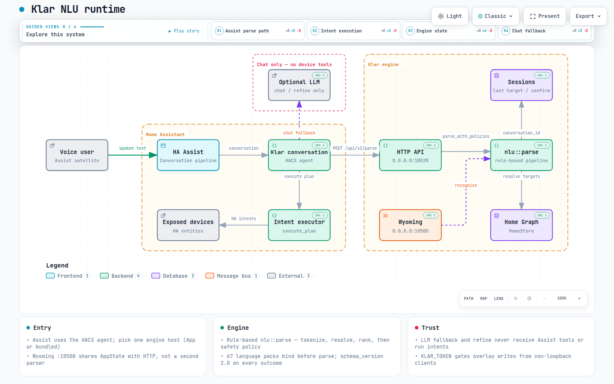
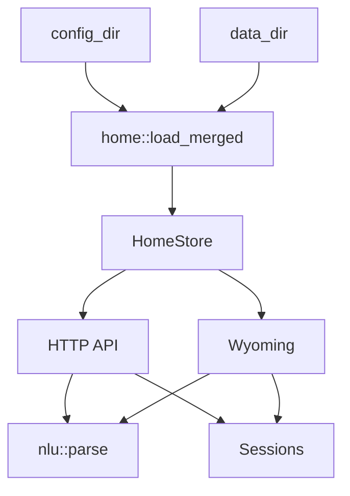

# Architecture

[Deutsch](../architecture.md) · [English](architecture.md)

Klar is a rule-based NLU. A sentence is tokenized, checked against word lists, and turned into Home Assistant intents. There is no neural net in the engine.

Proposal to split overlay rules, language seeds, and an LLM trainer: [ADR 0001](../architecture/adr-0001-rules-and-trainer.en.md).

## Runtime map

Interactive Assist → `POST /api/v2/parse` → `nlu::parse` → intent path, with Git-verified source ranges. Open [runtime.html](../architecture/runtime.html) locally; the typed source is [runtime.architecture.json](../architecture/runtime.architecture.json).

[](../architecture/runtime.html)

## Pipeline

```
Text
  → fold_latin / tokenize
  → strip fillers (bitte, please, the, …)
  → detect_actions / resolve / fill slots
  → rank complete IntentPlans
  → safety policy          execute / confirm / clarify / reject / chat
  → ParseOutcome           plan only on execute
```

In Home Assistant the spoken line can get a personality cue and, if enabled, an LLM rewrite (`custom_components/klar_nlu/refine.py`). The engine itself stays rule-based. Optional local semantic adapters may propose a typed plan after a ranking reject; they never execute devices.

`nlu::parse` in `src/nlu/` is the entry point and returns `ParseOutcome` (`schema_version: "2.0"`). Before parsing, Klar binds the packs listed in `Settings.languages` (`de`, `en`, …). Confirm, clarify, and reject never serialize `plan` or `candidates`.

## Layers

| Module | Role |
|--------|------|
| `src/types/` | Intent, `ParseOutcome`, settings, and home graph data types |
| `src/nlu/` | Candidate ranking, confidence/OOD/confirm policy, semantic adapters |
| `src/lang/` | Per-language word lists, external packs, user overlays |
| `src/home/` | Home graph loading, overlay, expose filtering, roles, and policy |
| `src/parse/` | Tokenize, actions, resolve, slots, spoken replies |
| `src/eval/` | Held-out metrics, Assist comparison, scorecard, benches |
| `src/migrate.rs` | One-shot V1 overlay dry-run / V2 save |
| `src/session.rs` | Last target, pending clarify/confirm |
| `src/io/` | HTTP (`/api/v2/parse`), Wyoming, privacy-safe bundles, bootstrap |

## Module Tree

```text
src/
  types/             intent, ParseOutcome, settings, HomeGraph
  nlu/               ranking, policy, semantic adapters
  home/              registry/YAML loading, overlay, policy, roles
  lang/              packs, catalog, user overlays
  parse/             tokenize, actions, resolve, slots, replies
  eval/              held-out scorecard and benches
  migrate.rs         V1 overlay import report
  session.rs         conversation memory
  io/                HTTP, Wyoming, runtime state, redacted bundles
  main.rs            CLI (lang / eval / migrate) then io::run
```

`lib.rs` exports these layers. Internal parse helpers stay under `src/parse/`; Home Assistant loading and overlay logic stay under `src/home/`.

## Home graph

On startup Klar reads `core.entity_registry`, `core.device_registry`, and `core.area_registry` from `--config-dir` (usually `/config`). Display names come from the device when the entity has no name of its own (`has_entity_name`). If the registry is missing, `default_home()` is used.

Devices are matched by name, aliases, tags, and area. Generic words (`Licht`, `light`) stay at area level when a room has several lights — then Klar asks.

`home::load_merged(config_dir, data_dir)` builds the effective graph:

1. Load the HA registry or sample home.
2. Apply the overlay from `config_dir`.
3. If `data_dir != config_dir`, apply the overlay from `data_dir` on top.
4. Take `Settings` and custom sentences from the last matching overlay.

`HomeStore` holds the current `Arc<HomeGraph>` and hands snapshots to HTTP and Wyoming. Reloads watch the HA registry files; when they change, Klar reloads the graph and swaps it atomically.



## Session

The same `conversation_id` shares a `Session`:

- last device / last area / last domain
- open clarify list (`Do you mean the ceiling or the lamp?`)
- pending confirm for risky lock/cover actions (plan stays in session until `yes`)
- `ja` / `yes` revalidates the stored plan against the current graph

## Intents

Klar emits the usual Assist intents, including:

`HassTurnOn`, `HassTurnOff`, `HassToggle`, `HassLightSet`, `HassClimateSetTemperature`, `HassGetState`, `HassSetPosition`, `HassFanSetSpeed`, `HassStartTimer`, `HassIncreaseTimer`, `HassShoppingListAddItem`, `HassMediaPause`, `HassMediaNext`, `HassVacuumStart`

Slots: `entity_id`, `area`, `floor`, `domain`, plus `brightness`, `temperature`, `position`, `percentage`, `color`, `duration` depending on the action.

## Limits

- No general world knowledge. “Tell me a joke” stays empty — in HA the fallback agent takes over.
- No tools in the engine. Devices run only through recognized intents. An optional LLM in HA may rewrite the finished confirmation; it does not get Assist tools for that step.
- Files stay under 500 lines; a new language is a new pack, not a longer `match` list.
