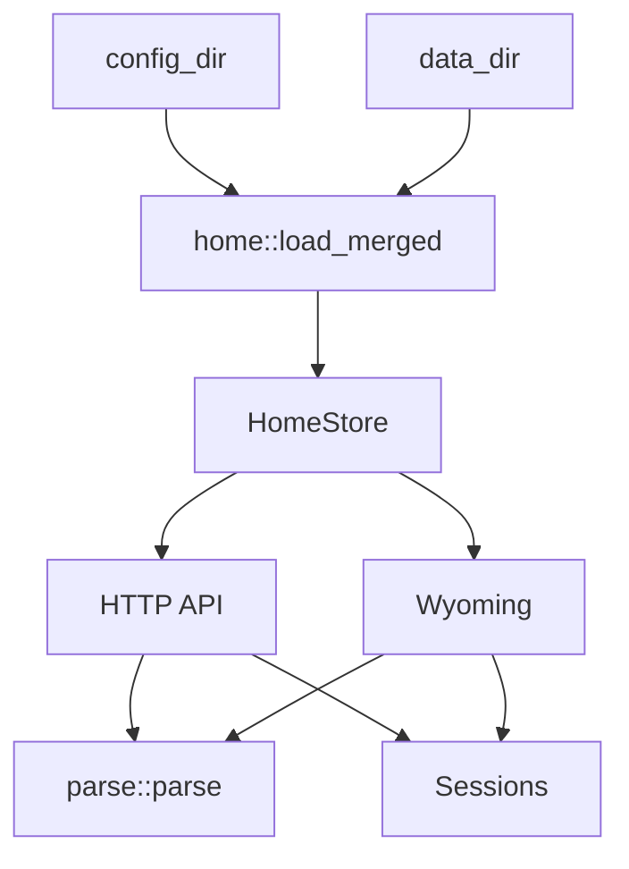

# Architecture

[Deutsch](../architecture.md) · [English](architecture.md)

Klar is a rule-based NLU. A sentence is tokenized, checked against word lists, and turned into Home Assistant intents. There is no neural net in the engine.

## Pipeline

```
Text
  → fold_latin / tokenize
  → strip fillers (bitte, please, the, …)
  → detect_actions          verb classes from the language packs
  → split_clauses           und / and / then when a new verb appears
  → resolve                 rooms and devices from the home graph
  → fill_intent             HassTurnOn, HassLightSet, …
  → speak                   short confirmation
```

In Home Assistant the spoken line can get a personality cue and, if enabled, an LLM rewrite (`custom_components/klar_nlu/refine.py`). The engine itself stays rule-based.

`parse()` in `src/parse/mod.rs` is the entry point. Before parsing, Klar binds the packs listed in `Settings.languages` (`de`, `en`, …).

The entry point stays intentionally narrow:

1. `preprocess` tokenizes and expands compound room/device words.
2. `route_non_home` detects news, chit-chat, correction, and LLM fallback.
3. `session_followups` handles yes/no, open clarifications, and custom sentences.
4. `parse_clauses` splits multi-command utterances and runs clause policies.
5. `fill_replay_or_need_target` fills follow-up targets or asks for a target.

## Layers

| Module | Role |
|--------|------|
| `src/types/` | Intent, settings, and home graph data types |
| `src/lang/` | Per-language word lists, merged in the catalog |
| `src/home/` | Home graph loading, overlay, expose filtering, roles, and policy |
| `src/parse/action.rs` | Verb class → `Action` (On, CoverOpen, SetTemp, …) |
| `src/parse/normalize.rs` | Tokens, accents, fillers |
| `src/parse/numbers.rs` | Number words and digits |
| `src/parse/split.rs` | Clauses, follow-up lights |
| `src/parse/resolve/` | Entity and area matches, scoring |
| `src/parse/mod.rs` / `src/parse/infer.rs` / `src/parse/slots.rs` | Orchestration, clarify, intents |
| `src/parse/respond.rs` | Spoken confirmation |
| `src/session.rs` | Last target, open clarification |
| `src/io/web.rs` | HTTP |
| `src/io/wyoming.rs` | Wyoming intent |
| `src/io/bootstrap.rs` | Server startup, token, reload loop |

## Module Tree

```text
src/
  types/             intent, settings, and HomeGraph types
  home/              registry/YAML loading, overlay, policy, roles, sample home
  lang/              language packs, catalog, speech templates
  parse/             NLU pipeline, actions, resolve, slots, replies
    resolve/         resolve facade plus scoring
  session.rs         conversation memory and clarify state
  io/                HTTP, Wyoming, runtime state, bootstrap
  main.rs            CLI arguments and logging, then io::run
```

`lib.rs` exports only these layers. Internal parse helpers stay under `src/parse/`; Home Assistant loading and overlay logic stay under `src/home/`.

## Home graph

On startup Klar reads `core.entity_registry`, `core.device_registry`, and `core.area_registry` from `--config-dir` (usually `/config`). Display names come from the device when the entity has no name of its own (`has_entity_name`). If the registry is missing, `default_home()` is used.

Devices are matched by name, aliases, tags, and area. Generic words (`Licht`, `light`) stay at area level when a room has several lights — then Klar asks.

`home::load_merged(config_dir, data_dir)` builds the effective graph:

1. Load the HA registry or sample home.
2. Apply the overlay from `config_dir`.
3. If `data_dir != config_dir`, apply the overlay from `data_dir` on top.
4. Take `Settings` and custom sentences from the last matching overlay.

`HomeStore` holds the current `Arc<HomeGraph>` and hands snapshots to HTTP and Wyoming. Reloads watch the HA registry files; when they change, Klar reloads the graph and swaps it atomically.



## Session

The same `conversation_id` shares a `Session`:

- last device / last area / last domain
- open clarify list (`Do you mean the ceiling or the lamp?`)
- `ja` / `yes` replays the last switch intent

## Intents

Klar emits the usual Assist intents, including:

`HassTurnOn`, `HassTurnOff`, `HassToggle`, `HassLightSet`, `HassClimateSetTemperature`, `HassGetState`, `HassSetPosition`, `HassFanSetSpeed`, `HassStartTimer`, `HassIncreaseTimer`, `HassShoppingListAddItem`, `HassMediaPause`, `HassMediaNext`, `HassVacuumStart`

Slots: `entity_id`, `area`, `domain`, plus `brightness`, `temperature`, `position`, `percentage`, `color`, `duration` depending on the action.

## Limits

- No general world knowledge. “Tell me a joke” stays empty — in HA the fallback agent takes over.
- No tools in the engine. Devices run only through recognized intents. An optional LLM in HA may rewrite the finished confirmation; it does not get Assist tools for that step.
- Files stay under 500 lines; a new language is a new pack, not a longer `match` list.
